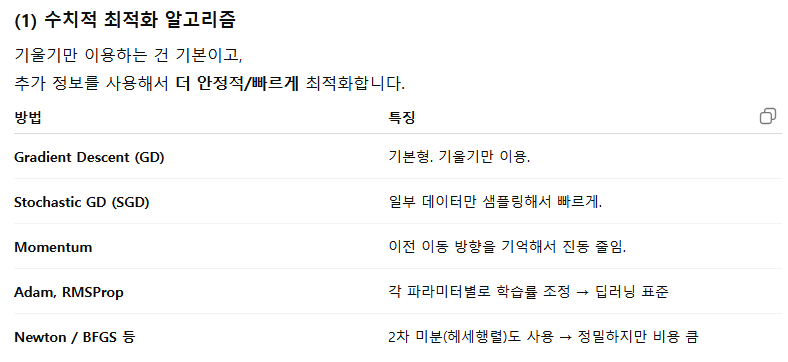

# AI 2일차

- 진도를 하도 많이 나가서 주제 통합하기도 힘들다..
- ML 기초 원리 쭉 배웠음

## Keywords

- 최소제곱법(OLS)
- 잔차제곱합(RSS)
- 손실함수 최적화

- 로지스틱 회귀
- 시그모이드(sigmoid)
- shallow network
- 경사하강법(gradient descent)

## 나만의 언어로 요약

### 주요 개념

- RSS : 모델 성능 평가지표로서 쓸 지표를 잔차제곱합으로 만들고 그걸 최적화하기 위해 편미분계수가 0인 지점을 구하는 거
- 로지스틱 회귀 : 모델이 추론한 최적의 가중치를 대입했을 때 나온 z값과 추론 대상이 되는 데이터포인트를 시그모이드 함수에 대입해서 나온 값이 이진분류에서 True일 확률이다.
  - 활성화함수만 소프트맥스로 바꿔주면 다중 분류도 같은 원리로 되고..
- 보편 근사 정리 : 무한히 많은 hidden unit을 가질 수 있다면, shallow network에서도 모든 연속함수를 1 미만의 원하는 정확도로 근사할 수 있다.

### 수업 핵심 개념

- 수업은 ML모델이 학습하는 방식에 대해 이야기하고 있어.
- 하나의 독립변수 X와 종속변수 y가 있고, X와 y의 선형관계(1차함수)를 추정해야 하는 회귀를 한다고 쳐봐.
- y는 ax+b 형태의 함수일 거고, 모델은 이 데이터셋을 가장 잘 설명할 수 있는 a와 b를 찾고 싶은 거야. 이 a와 b같은 파라미터들을 가중치라고 불러.
- a와 b에 임의의 수를 대입한 후에 계산을 해보면, 계산된 값과 실제값 사이에 오차가 있을 거 아냐. 이걸 잔차라고 부르는데, 당연히 작을 수록 좋겠지? 그리고 하나의 데이터포인트에 대해서만 계산을 하는게 아니라 데이터셋에 있는 수많은 데이터포인트들에 대해 잔차를 다 구하게 될 거야.
- 그럼 잔차를 다 더해야 하는데, 잔차는 양수일 수도 있고 음수일 수도 있으니까 그냥 더해버리면 실제 loss를 제대로 반영하지 못하니까, 절대값을 붙이거나 제곱을 해서 다 같은 방향으로 바꿔줘야 해.
- 근데 일반적으로 큰 loss에는 더 큰 페널티를 부여하고 싶어하기 때문에, 개별 잔차에 제곱을 한 후에 더해주는 방식을 많이 사용해. 통계학에서 분산을 구할 때랑 똑같지?
- 그래서 잔차제곱합(RSS)이나 최소제곱법이라는 개념이 나오는 거.
- 그럼 이제 평가지표가 되는 손실함수는 잔차에 대한 이차식일텐데, 잔차는 위에서 말한 두 개의 가중치에 의해 정의되기 때문에 손실함수는 각 파라미터에 대한 이차식이기도 해.
- 이차식의 최적화(극소화)는 미분계수가 0인 지점에서 이루어지잖아.
- 그래서 이차식을 각 가중치에 대해 편미분하면 일차식이 나오고, 일차항의 계수(기울기)의 부호를 보고서 기울기를 0으로 만드는 방향으로 파라미터를 업데이트하는 거야.
- 그리고 그 업데이트된 파라미터로 다시 값을 예측하고, 잔차제곱합을 구하고, 그 기울기를 구하고.. 이 과정을 계속 반복하면서 최적의 가중치 a와 b를 찾아내는 거야. 이 과정을 경사하강법이라고 부르는 거고.

- 이제 이걸 다중회귀, 그러니까 독립변수가 여러 개인 케이스로 확장해보면,
- 이제 모델은 더 많은 가중치(x1, x2, x3, ... y절편)를 추정하게 될 건데,
- 그 추정된 파라미터의 집합은 `feature(독립변수) 수 + 1`차원 공간상의 한 점으로 존재하게 되겠지.
- 차원수가 늘어나긴 하지만, 공간상의 한 점을 추정하는 건 일차함수일 때랑 본질적으로 같은 거야.
- 이제 선형함수인 경우, 그러니까 y가 x에 대한 일차함수인 경우에서 고차함수인 경우로 확장을 해야 하는데,
- 이 때는 고차함수의 파라미터를 직접 추정하는게 아니라, 그 함수를 여러 구간으로 나누고 각 구간을 일차함수로 근사하는 방법을 사용해.
- 고차함수는 파라미터 개수가 기하급수적으로 증가하고, 각 항들 사이에 상관관계가 나타나고, 기울기도 고차함수가 되면서 변곡점이 생기니까 기울기의 부호가 불안정하게 나타나고 최적화가 어려워지기 때문이야.
- 어떤 복잡한 함수든, 그걸 엄청 많은 여러 구간으로 쪼개고 각 구간을 일차함수로 나타낸 후에 손실함수(잔차제곱합)를 극소화하는 방향으로 가중치를 업데이트하는 거야.

- 이게 최대한 수식을 덜 쓰고 표현한 경사하강법이나 최소제곱법의 핵심 개념인 듯..

- 위에서 한 작업이 단층 신경망에서 하나의 층에서 하는 거고..
- DL모델들은 저 층(은닉층)을 여럿 쌓아서 반복하거든?
- 그럼 오차가 이 수많은 층들을 지나는 합성함수의 형태가 되는데,
- 이 합성함수의 형태에서 오차를 특정 가중치로 편미분한 값을 chain rule로 역산해서
- 최종적으로 가중치의 기울기를 구해서 업데이트하는 과정을 역전파라고 하고, 이게 다층 신경망(DL모델)에서 손실함수를 최적화하는 방식이야.

## 질문 / 답변

- Q1-1. MSE를 쓸 때는 잔차제곱합이 이차식이니까 feature로 편미분해서 최적화할 수 있잖아. 근데 평가지표로 MAE를 쓰고 싶으면 최적화를 어떻게 해? 그건 일차식이잖아
  - 잔차의 기울기 부호를 보고 절대값이 0에 가까워지는 방향으로 업데이트하면 되지.
  - 경사하강은 몇차식이든 기울기 방향으로 값을 줄여나가는 동일한 메커니즘으로 활용될 수 있음.

- Q1-2. 그럼 반대로 3차식 이상의 고차식이 평가지표로 사용될 때도 마찬가지일 것 같긴 한데, 그 때는 미분계수가 0인 지점이 여러 군데일거 아냐. 그건 어떻게 해?
  - 사람이 보는 평가지표로서 3차 이상 고차식을 쓰는 경우가 많지는 않고..
  - DL모델들이 내부적으로 쓰는 손실함수들은 대개 수십~수백 차수의 합성함수임.
  - 물론 경사하강의 원리는 동일하게 사용되지만, 이 때는 아래와 같은 방법들을 복합적으로 활용함.

- Q2-1. 손실함수든 우도든 어차피 모델에 대한 평가지표인데 구하는 방식만 역인 거지? 왜 둘다 필요하지?

  - ㅇㅇ. 손실함수는 `- log(likelyhood)`임

  - 최적화할 때 손실함수는 극소값, likelyhood는 극대값을 찾아야 하니까 방향만 다르고, 같은 걸 바라보고 있는 지표들임

  - 다만 그 지표를 바라보는 관점이 다른 거

    

- Q2-2. 그니까 ml에서는 파라미터 자체를 추정하는게 중요하니까 오차 값 자체에 집중하고, 통계학에서는 모델의 설명력을 중요하게 생각하니까 우도를 계산하는 건데, 사실 가리키는 지표는 같은 거라는 거지?

  - ㅇㅇ 잘 정리된 듯.
  
  

- Q3-1. 입력값을 그대로 더해준다는게, 결국 손실함수의 기울기에 1을 더해주는 거잖아? 그걸로 기울기 소실 문제가 해결될 것 같으면 다른 모든 모델에서는 왜 못 쓰지? 가령 sigmoid에도 + x 해주면 똑같이 작동하는거 아냐?
    - 모든 상황에 이 방법을 쓸 수 있는게 아님. 많은 모델에서, 한 층을 지나갈 때 입력값과 출력값의 구조 및 실제 값의 차이가 매우 적기 때문에 사용하는 것이고, 층을 지날 때 비선형적이거나 독립적인 값으로 변환시켜야 하는 경우에는 이러한 방법을 사용할 수 없음.
    - sigmoid처럼 입력값과 출력값의 관계가 비선형적인 경우는 더해준 x값이 학습을 방해할 수 있음
    - NLP 등 비선형적인 관계를 학습해야 하는 경우는 비슷한 알고리즘을 사용하기 어렵고, 점진적인 변화를 학습하는 경우에 사용되는 모델들(EfficientNet, DenseNet 등)은 비슷한 알고리즘을 사용하고 있음. 특히 이미지 분류를 위한 대부분의 현대적 모델이 ResNet과 비슷한 알고리즘을 사용하고 있음.
- Q3-2. 출력값이 `H(x) - x` 라면, F(x) 부분과 x 부분을 구분하여 전달하지 않는 이상 모델은 x가 몇인지 모를텐데 어떻게 `H(x) - x` 에 대해서만 학습을 한다는 거야?
    - 명시적으로 그 부분에 대해서만 학습하라고 하는 것이 아니라, x가 항상 더해지면 구조적으로 그 부분을 빼고 학습하도록 유도된다는 거임. 애초에 잔차를 학습하는 거니까 양변에 뭘 더해놓든 상관이 없는 거.
    - 만약 x와 f(x)에 서로 다른 가중치나 규제를 부여한다든지 하는 이유로 둘을 구분해서 전달하고 싶다면 그렇게 할 수는 있음. 대신 학습 시간은 늘어나겠지.
- Q3-3. 역전파시 기울기가 크면 기울기 소실이 덜 일어나는 메커니즘이 이해가 안 되는데.
    - 층을 지날 때마다 앞으로 전달되는 기울기가 점점 작아지기 때문에 초기층까지 의미있는 기울기값이 전달되지 않을 수 있는데, 1을 더해놓고 시작하면 최소한의 기울기가 보장되어 더 멀리까지 전파가 이루어질 수 있음.

- Q4. 딥러닝 모델들 하이퍼파라미터가 겁나 많잖아. 이거 최적화하려면 randomsearchcv로 대충대충 돌려도 너무 많이 돌려봐야 할 것 같은데 말이 안 되는데? 일반적으로 몇 epochs나 돌려봐야 유의미한 테스트가 될까?
    - 다 상황마다 다른데 잘~해야지. 효율적으로 튜닝하는 방법들 정리해줌.
    - 보통 GridSearchCV나 RandomSearchCV보단 HyperOpt나 Optuna같은 베이지안 최적화 모듈을 쓰는게 좋음.
    - earlystopping은 항상 걸어 놓기.
    - lr, dropout rate, batch size 등 영향을 많이 미치는 놈들부터 튜닝한 후에 세부 튜닝을 들어가는 식으로 순차적 최적화.
    - 5~10 epoch로 초기탐색 후 괜찮은 놈들만 추려서 20~50으로 한 번 더 탐색.
    - 테스트할 때는 데이터를 일부만 사용해서 학습시킴.
    - 데이터에 대한 지식을 활용해서 굳이 튜닝해보지 않아도 되는 파라미터들을 고정.

- Q5. 하나의 데이터셋 내에서 stratrify속성 주고, 테스트데이터와 훈련데이터를 나눠서 학습시키고 테스트하면, 코드를 잘못 쓰지 않는 한 당연히 설명력이 높게 나올 수밖에 없는거 아니냐? 데이터셋 전체가 가지고 있는 bias에 대해서는 전혀 처리가 안 되는 거잖아.
  전혀 다른 소스에서 나온 데이터셋을 테스트데이터로 써야 새로운 데이터를 예측할 때도 충분히 설명력이 있다고 볼 수 있는 게 아닌지?
    - 데이터의 양이 충분히 크다면 bias에 대해서는 이미 처리가 된 상태에서 훈련에 들어간다고 봐야 함.
    - 물론 데이터가 가진 bias에 대한 고민도 계속 필요하긴 한데.. 훈련데이터와 테스트데이터의 규격이 맞아야 하고, 어차피 다 같은 형태의 데이터라면 굳이 어떤 놈은 훈련으로 쓰고 어떤 놈은 테스트로 쓰는게 오히려 현실 설명력을 떨어뜨릴 수 있을 듯.
    - 데이터 전처리 과정에서 어떤 데이터는 drop한다든지.. 여러 방법으로 bias를 잡고, 데이터셋 자체에는 편향이 거의 없다고 가정한 후에 훈련에 들어간다고 생각하면 될 듯.

- Q6. Polynomial Features로 특성 개수 늘리는 방식이 좀 무식해 보이는데.. 애초에 독립변수의 설명력이 떨어지는데 특성 개수 늘려서 강제로 R^2값을 높이면 안 되는 거 아님?
    - 특성 개수 늘린다고 R^2값이 무조건 늘어나는 건 아님. 적절한 수준을 넘어서면 오히려 떨어지기 때문에, R^2값이 너무 낮다 싶을 때는 어느 정도 선까지는 특성 개수를 늘려서 R^2값을 높여주는 것이 일반적으로 좋음.
    - 다만 특성 개수 늘리기를 포함한 특성공학 전반에는 도메인 지식이 많이 개입하는 편. 특성개수 늘려놓은 다음에 그 중에 R^2 낮은 놈만 골라서 탈락시킬 수도 있는 거고(특성 선택)..
