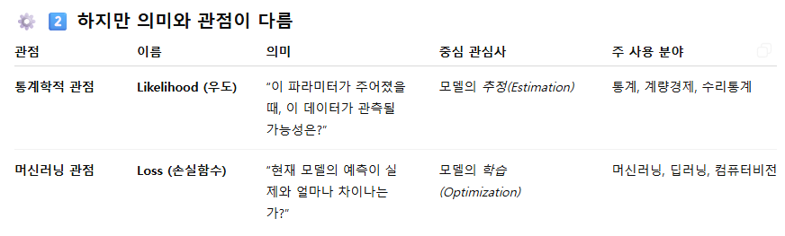

# AI 2일차

- 진도를 하도 많이 나가서 주제 통합하기도 힘들다..

## Keywords

- 최소제곱법(OLS)
- 잔차제곱합(RSS)
- 손실함수 최적화

- 로지스틱 회귀
- 시그모이드(sigmoid)
- shallow network
- 경사하강법(gradient descent)

## 나만의 언어로 요약

### 주요 개념

- RSS : 모델 성능 평가지표로서 쓸 지표를 잔차제곱합으로 만들고 그걸 최적화하기 위해 편미분계수가 0인 지점을 구하는 거
- 로지스틱 회귀 : 모델이 추론한 최적의 가중치를 대입했을 때 나온 z값과 추론 대상이 되는 데이터포인트를 시그모이드 함수에 대입해서 나온 값이 이진분류에서 True일 확률이다.
  - 활성화함수만 소프트맥스로 바꿔주면 다중 분류도 같은 원리로 되고..
- 보편 근사 정리 : 무한히 많은 hidden unit을 가질 수 있다면, shallow network에서도 모든 연속함수를 1 미만의 원하는 정확도로 근사할 수 있다.

### 수업 핵심 개념

- 수업은 ML모델이 학습하는 방식에 대해 이야기하고 있어.
- 하나의 독립변수 X와 종속변수 y가 있고, X와 y의 선형관계(1차함수)를 추정해야 하는 회귀를 한다고 쳐봐.
- y는 ax+b 형태의 함수일 거고, 모델은 이 데이터셋을 가장 잘 설명할 수 있는 a와 b를 찾고 싶은 거야. 이 a와 b같은 파라미터들을 가중치라고 불러.
- a와 b에 임의의 수를 대입한 후에 계산을 해보면, 계산된 값과 실제값 사이에 오차가 있을 거 아냐. 이걸 잔차라고 부르는데, 당연히 작을 수록 좋겠지? 그리고 하나의 데이터포인트에 대해서만 계산을 하는게 아니라 데이터셋에 있는 수많은 데이터포인트들에 대해 잔차를 다 구하게 될 거야.
- 그럼 잔차를 다 더해야 하는데, 잔차는 양수일 수도 있고 음수일 수도 있으니까 그냥 더해버리면 실제 loss를 제대로 반영하지 못하니까, 절대값을 붙이거나 제곱을 해서 다 같은 방향으로 바꿔줘야 해.
- 근데 일반적으로 큰 loss에는 더 큰 페널티를 부여하고 싶어하기 때문에, 개별 잔차에 제곱을 한 후에 더해주는 방식을 많이 사용해. 통계학에서 분산을 구할 때랑 똑같지?
- 그래서 잔차제곱합(RSS)이나 최소제곱법이라는 개념이 나오는 거.
- 그럼 이제 평가지표가 되는 손실함수는 잔차에 대한 이차식일텐데, 잔차는 위에서 말한 두 개의 가중치에 의해 정의되기 때문에 손실함수는 각 파라미터에 대한 이차식이기도 해.
- 이차식의 최적화(극소화)는 미분계수가 0인 지점에서 이루어지잖아.
- 그래서 이차식을 각 가중치에 대해 편미분하면 일차식이 나오고, 일차항의 계수(기울기)의 부호를 보고서 기울기를 0으로 만드는 방향으로 파라미터를 업데이트하는 거야.
- 그리고 그 업데이트된 파라미터로 다시 값을 예측하고, 잔차제곱합을 구하고, 그 기울기를 구하고.. 이 과정을 계속 반복하면서 최적의 가중치 a와 b를 찾아내는 거야. 이 과정을 경사하강법이라고 부르는 거고.

- 이제 이걸 다중회귀, 그러니까 독립변수가 여러 개인 케이스로 확장해보면,
- 이제 모델은 더 많은 가중치(x1, x2, x3, ... y절편)를 추정하게 될 건데,
- 그 추정된 파라미터의 집합은 `feature(독립변수) 수 + 1`차원 공간상의 한 점으로 존재하게 되겠지.
- 차원수가 늘어나긴 하지만, 공간상의 한 점을 추정하는 건 일차함수일 때랑 본질적으로 같은 거야.
- 이제 선형함수인 경우, 그러니까 y가 x에 대한 일차함수인 경우에서 고차함수인 경우로 확장을 해야 하는데,
- 이 때는 고차함수의 파라미터를 직접 추정하는게 아니라, 그 함수를 여러 구간으로 나누고 각 구간을 일차함수로 근사하는 방법을 사용해.
- 고차함수는 파라미터 개수가 기하급수적으로 증가하고, 각 항들 사이에 상관관계가 나타나고, 기울기도 고차함수가 되면서 변곡점이 생기니까 기울기의 부호가 불안정하게 나타나고 최적화가 어려워지기 때문이야.
- 어떤 복잡한 함수든, 그걸 엄청 많은 여러 구간으로 쪼개고 각 구간을 일차함수로 나타낸 후에 손실함수(잔차제곱합)를 극소화하는 방향으로 가중치를 업데이트하는 거야.

- 이게 최대한 수식을 덜 쓰고 표현한 경사하강법이나 최소제곱법의 핵심 개념인 듯..

- 위에서 한 작업이 단층 신경망에서 하나의 층에서 하는 거고..
- DL모델들은 저 층(은닉층)을 여럿 쌓아서 반복하거든?
- 그럼 오차가 이 수많은 층들을 지나는 합성함수의 형태가 되는데,
- 이 합성함수의 형태에서 오차를 특정 가중치로 편미분한 값을 chain rule로 역산해서
- 최종적으로 가중치의 기울기를 구해서 업데이트하는 과정을 역전파라고 하고, 이게 다층 신경망(DL모델)에서 손실함수를 최적화하는 방식이야.

## 질문 / 답변

- Q1-1. MSE를 쓸 때는 잔차제곱합이 이차식이니까 feature로 편미분해서 최적화할 수 있잖아. 근데 평가지표로 MAE를 쓰고 싶으면 최적화를 어떻게 해? 그건 일차식이잖아
  - 잔차의 기울기 부호를 보고 절대값이 0에 가까워지는 방향으로 업데이트하면 되지.
  - 경사하강은 몇차식이든 기울기 방향으로 값을 줄여나가는 동일한 메커니즘으로 활용될 수 있음.

- Q1-2. 그럼 반대로 3차식 이상의 고차식이 평가지표로 사용될 때도 마찬가지일 것 같긴 한데, 그 때는 미분계수가 0인 지점이 여러 군데일거 아냐. 그건 어떻게 해?
  - 사람이 보는 평가지표로서 3차 이상 고차식을 쓰는 경우가 많지는 않고..
  - DL모델들이 내부적으로 쓰는 손실함수들은 대개 수십~수백 차수의 합성함수임.
  - 물론 경사하강의 원리는 동일하게 사용되지만, 이 때는 아래와 같은 방법들을 복합적으로 활용함.

- Q2-1. 손실함수든 우도든 어차피 모델에 대한 평가지표인데 구하는 방식만 역인 거지? 왜 둘다 필요하지?

  - ㅇㅇ. 손실함수는 `- log(likelyhood)`임

  - 최적화할 때 손실함수는 극소값, likelyhood는 극대값을 찾아야 하니까 방향만 다르고, 같은 걸 바라보고 있는 지표들임

  - 다만 그 지표를 바라보는 관점이 다른 거

    

- Q2-2. 그니까 ml에서는 파라미터 자체를 추정하는게 중요하니까 오차 값 자체에 집중하고, 통계학에서는 모델의 설명력을 중요하게 생각하니까 우도를 계산하는 건데, 사실 가리키는 지표는 같은 거라는 거지?

  - ㅇㅇ 잘 정리된 듯.

