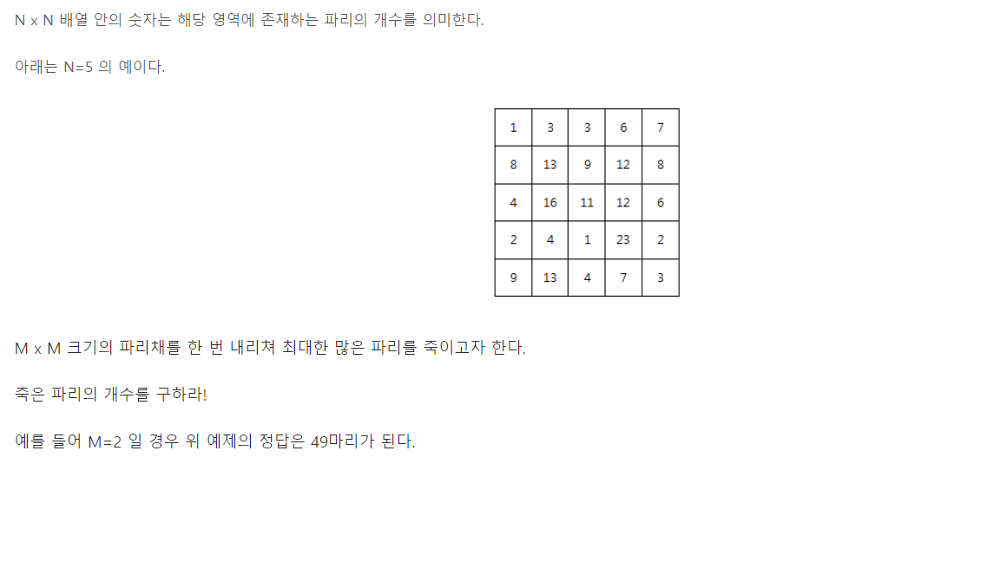

# 부분합을 이용한 알고리즘 최적화

## 

## 문제

### 기본적인 접근법은..

- 배열을 벗어나지 않는 선에서 파리채(M*M배열)를 움직여가며 킬수를 기록하고 max값을 찾는 완전탐색

- 근데 좀 최적화할 수 있지 않을까 해서 방법을 생각해봄

### 방법 1 : 부분합을 통한 후보군 축소

- 전체 배열을 여러 sector로 나누고, 부분합이 낮은 곳들은 탐색에서 제외
- 근데 이건 분명히 예외케이스가 생길 수밖에 없음. 시간복잡도는 1/sector로 줄어들고, 그 sector 안에서 같은 방법을 연속적으로 사용할 경우 1/sector^2로 줄어들겠지만, 쓰는 만큼 정확성도 희생하는 방식임

### 방법 2 : 부분합을 통한 지역적 크기 비교

- 전체 배열을 여러 sector로 나누되, 겹치는 부분이 있도록 하여 상호배타적 집합간 크기 비교를 통해 최적값 위치의 후보군을 줄여나가는 방식
- 처음에 생각하기에는 예외 케이스가 없도록 만들 수 있지 않을까 했는데.. 섹터의 범주가 넓고 수가 적을 수록 예외 케이스가 있을 가능성이 높아지고, 결국 한 칸 단위까지 sector를 좁히기 전에는 예외 케이스의 가능성을 완전히 없앨 수는 없음
- 즉 이것도 정확성을 희생하는 방식

### 방법 3 : 최대값 1개와 부분합의 크기 비교

- 전체 칸을 탐색하여 한 칸의 max값을 구하고, n*m의 sector에 대해 부분합을 구한 후 크기 비교를 반복
- max  > 부분합인 경우, 해당 sector는 탐색에서 완전히 제외해도 됨
- 이건 예외 케이스 없이 구현 가능. 정확성을 희생하지 않고도 시간복잡도를 낮출 수 있음. 물론 효과는 위의 두 방법보단 미미할 수 있음
- 한 칸에 들어갈 수 있는 파리 수의 최대치가 크고, 배열 속 실제 파리 분포가 불균형할수록 효과가 압도적으로 커지는 방법

## 감상

- 당장 내 수준에선 문제들이 최적화를 요구하지 않기도 하고.. 이 케이스는 구현하긴 꽤 복잡해 보여서 당장은 손대기가 좀 어려울 듯. 기초 유형들 따라가기도 벅차니 일단 보류.
- 그렇지만 실제 데이터를 다룰 때는 데이터의 특성에 따라 정확성을 거의 희생하지 않고도 효율성을 엄청나게 높일 수 있는 케이스가 있고
- 가용 리소스의 제한 때문에 정확성을 희생하더라도 어쩔 수 없이 최적화를 해야 하는 케이스도 있을테니..
- 이런 방법들을 생각해보는게 장기적으로는 의미가 있을 듯
- 같이 공부하는 분들이 내 아이디어를 집중해서 들으면서 같이 고민하고 발전시켜 주셔서 감사했다.

