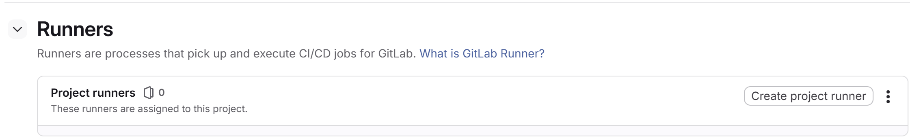

# GitLab CI/CD

- GitHub랑 달리 SSAFY가 제공하는 GitLab은 별도의 CI/CD용 서버를 제공하지 않음
- 로컬에 CI/CD용 컨테이너 별도로 띄워서 사용할 것
- https://docs.gitlab.com/runner/install/docker/


## Repo 설정

### Runner 토큰 발급

- Settings -> CI CD -> Runners -> Create project runner



- Run untagged jobs 체크하고 `create`


## 설정파일 작성

- `./gitlab-ci.yml`

  ```yaml
  # 1. 파이프라인 전체 스테이지 정의
  stages:
    - test          # 코드 문법 검사 및 단위 테스트
    - build-package # 도커 이미지 빌드 및 푸시
  
  # 전역 변수 설정
  variables:
    # 도커 속도 향상을 위한 드라이버 설정
    DOCKER_DRIVER: overlay2
    DOCKER_TLS_CERTDIR: "/certs"
    # 이미지 태그: master 브랜치는 'latest', 나머지는 '브랜치명'으로 태깅
    IMAGE_TAG: $CI_REGISTRY_IMAGE:$CI_COMMIT_REF_SLUG
    LATEST_TAG: $CI_REGISTRY_IMAGE:latest
    # pip 캐시 디렉토리 설정
    PIP_CACHE_DIR: "$CI_PROJECT_DIR/.cache/pip"
  
  # 빌드용 DinD 활성화
  services:
    - name: docker:24.0.5-dind
      command: ["--tls=false"]
  
  # =========================================================
  # Stage 1: TEST (품질 관리)
  # =========================================================
  test_python:
    image: python:3.11-slim
    stage: test
    # pip 캐시 설정: requirements.txt가 변경될 때만 캐시 갱신
    cache:
      key:
        files:
          - requirements.txt
      paths:
        - .cache/pip
    script:
      - pip install -r requirements.txt
      - pip install flake8
      # 1. 문법 검사
      - flake8 . --count --select=E9,F63,F7,F82 --show-source --statistics
      - flake8 . --count --exit-zero --max-complexity=10 --max-line-length=127 --statistics
  
  # =========================================================
  # Stage 2: BUILD & PUSH
  # =========================================================
  build_arm64:
    image: docker:24.0.5
    stage: build-package
    before_script:
      # 깃랩 레지스트리 로그인
      - echo "$CI_REGISTRY_PASSWORD" | docker login -u "$CI_REGISTRY_USER" --password-stdin $CI_REGISTRY
      # ARM64 에뮬레이터 설치 (QEMU)
      - docker run --rm --privileged multiarch/qemu-user-static --reset -p yes
      # Buildx 인스턴스 생성
      - docker buildx create --use
    script:
        - echo "Building Docker Image for ARM64..."
        # 기본 이미지 태그는 항상 붙이고, master일 때만 latest 태그를 동적으로 추가
        # --cache-from/to: 이전 빌드 레이어를 재사용하여 속도 최적화
        - docker buildx build --platform linux/arm64 \
            --cache-from type=registry,ref=$CI_REGISTRY_IMAGE:cache \
            --cache-to type=registry,ref=$CI_REGISTRY_IMAGE:cache,mode=max \
            -t $IMAGE_TAG \
            $( [ "$CI_COMMIT_BRANCH" = "master" ] && echo "-t $LATEST_TAG" ) \
            --push .
        - echo "Build & Push Complete!"
      
    # master 브랜치에 푸시될 때만 실행
    only:
      - master
  ```

  

- ./Dockerfile

  ```dockerfile
  # 1. Base Image: 파이썬 3.11
  FROM python:3.11-slim
  
  # 2. 필수 패키지 설치 (OpenCV 구동용 라이브러리 포함)
  # libgl1-mesa-glx: OpenCV 에러 방지용
  RUN apt-get update && apt-get install -y \
      libgl1-mesa-glx \
      libglib2.0-0 \
      libgomp1 \
      gcc \
      && rm -rf /var/lib/apt/lists/*
  
  # 3. 작업 디렉토리 설정
  WORKDIR /app
  
  # 4. 의존성 파일 복사 및 설치
  COPY requirements.txt .
  RUN pip install --no-cache-dir -r requirements.txt
  
  # 5. 소스 코드 복사
  COPY . .
  
  # 6. 실행 명령어
  # -u 옵션: 파이썬 로그가 버퍼링 없이 바로 출력되게 함 (디버깅용)
  CMD ["python", "-u", "main.py"]
  ```

  

## Docker 컨테이너 세팅

### 1. 로컬 터미널에서 명령어 실행 후 지시에 따라 차례로 입력

```bash
docker run --rm -it -v gitlab-runner-config:/etc/gitlab-runner gitlab/gitlab-runner register
```

- `Enter the GitLab instance URL (for example, https://gitlab.com/):`
  - GitLab URL 입력
  - https://lab.ssafy.com/
- `Enter the registration token:`
  - 위에서 발급받은 runner 토큰
  - glrt-xxxx
- `Enter a name for the runner. This is stored only in the local config.toml file:`
  - 그냥 runner 이름이니까 아무 거나 쳐도 됨

- `Enter an executor: virtualbox, docker+machine, instance, custom, shell, docker, docker-windows, kubernetes, docker-autoscaler, ssh, parallels:`
  - docker
- `Enter the default Docker image (for example, ruby:3.3):`
  - docker:24.0.5
- `Runner registered successfully. Feel free to start it, but if it's running already the config should be automatically reloaded! Configuration (with the authentication token) was saved in "/etc/gitlab-runner/config.toml"`

### 2. Docker 권한 설정

- DinD 사용을 위한 privileged mode 설정

```bash
docker run --rm -v gitlab-runner-config://etc/gitlab-runner alpine sed -i 's/privileged = false/privileged = true/' //etc/gitlab-runner/config.toml
```

### 3. Docker Container 실행

```bash
docker run -d --name gitlab-runner --restart always -v //var/run/docker.sock:/var/run/docker.sock -v gitlab-runner-config://etc/gitlab-runner gitlab/gitlab-runner:latest
```


## 소감

- Github Actions는 많이 써봤고 GitLab CI/CD는 처음인데, 어차피 yaml파일 기반이고 포맷도 대체로 비슷해서 이해하기 어렵진 않았음
- 로컬 컨테이너 띄워서 빌드/배포하는 건 처음이긴 한데 어차피 초기 세팅 조금 말고는 다 고만고만했음. Jenkins 공부 시작했는데 이것도 비슷할 듯?
- GitLab 웹 UI가 좀 더 구린 것 같긴 한데 적응하는 중
- yolo 쓸거라 테스트용으로 Ultralytics 설치했더니 빌드/배포 파이프라인 한 사이클 도는데 8분 걸리길래 캐시 활용했더니 2분 20초정도까진 줄였음.
  - 그래도 프로젝트 볼륨 커질수록 더 늘어날 거고.. 아주 빠른 것 같지는 않아서 좀 더 최적화할 수 있을지 찾아보긴 할 듯