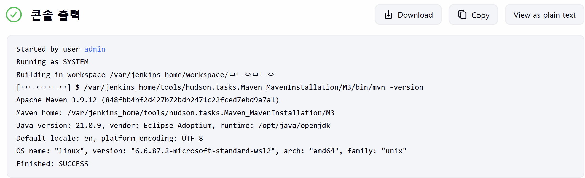

# Jenkins


## 설치 및 실행

- https://www.jenkins.io/doc/book/installing/docker/

- 인스톨러로 로컬에 설치할 수도 있는데..
- 프로젝트에서 쓸 거고 서버를 올릴 수도 있어서 처음부터 docker로 깔았음

### 1. Docker Daemon 실행

```bash
docker run --name jenkins-docker --rm --detach --privileged --network jenkins --network-alias docker --env DOCKER_TLS_CERTDIR=/certs --volume jenkins-docker-certs:/certs/client --volume jenkins-data:/var/jenkins_home --publish 2376:2376 docker:dind
```

### 2. Jenkins 실행

```bash
docker run -d -p 8080:8080 -p 50000:50000 --name myjenkins jenkins/jenkins:lts
```

### 3. 설정된 비밀번호 확인

```
docker logs myjenkins
```


## 초기 설정

### 1. Jenkins 웹브라우저 접속

- localhost:8080
- 확인한 비밀번호 입력
- Suggested Plugin 설치
- admin 계정 생성

### 2. Maven 설정

- settings -> tools -> maven add하고 save

### 3. Smoke Test

- 새로운 Item 만들기
  - item name 아무렇게나 설정
  - Freestyle Project 지정
  - Build Steps -> Add build step -> Invoke top-level Maven targets 선택
  - Maven version 지정
  - Goals에 `-version` 등 간단한 코드 입력

- 지금 빌드 클릭

  - 빌드 로그 확인 가능

    

