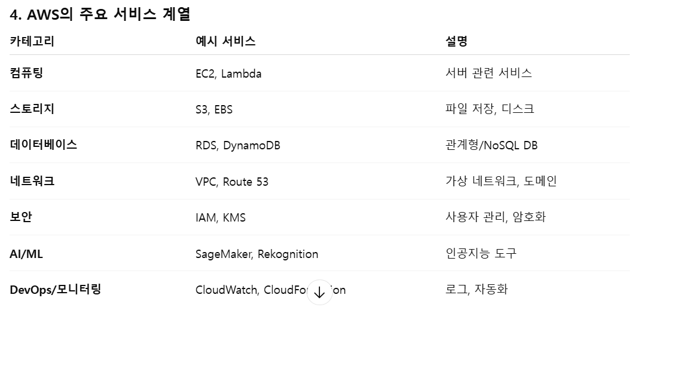

# AWS

- Amazon Web Services
- 전세계 여러 지역에 데이터 센터를 운영하는 클라우드 서비스
- on-demand형 과금 구조

## AWS의 장점

- 유연성
  - scale-out 방식의 auto-scaling으로 트래픽 증가에 유연하게 대응
- 가용성/안정성
  - 다양한 지역에 물리적으로 분리되어 있는 센터를 운영하여 특정 물리서버 또는 지역에 장애가 생겨도 안정적으로 작동

- 보안성
  - 다양한 보안 관련 인증 보유
  - human error를 제외하면 뚫린 적이 없다고 봐도 무방한 보안 체계
    - Shared Responsibility Model(보안 책임 분담 모델) 사용
      - key 관리, 권한 설정, 데이터 암호화 등의 보안 책임이 사용자에게 분산되어 있음을 유의

## AWS 주요 서비스

- 우리가 free-tier로 가볍게 써볼 건 Elastic Beanstalk, EC2, S3(static files의 저장소) 정도?

## About Free-tier

- EC-2, S3 등 주요 서비스에 대해 가입 후 1년간 free-tier 제공
  - EC-2의 경우 월 750시간(1개 인스턴스 24시간 풀가동 가능) 제공
  - load-balancer, route53 등 다른 서비스나 부가 기능 활용시 과금될 수 있음

## Root | IAM

- Root는 모든 리소스에 대해 완전한 권한을 가지고 있는 계정
- IAM은 Root가 부여한 권한에 따라 한정된 작업만 할 수 있는 계정, 전용 url을 통해 로그인
- 최소 권한 원칙에 따라 실무에서 Root는 아예 안 쓴다고 보면 됨
  - 모든 실습도 IAM계정을 생성한 후 IAM 계정을 통해 이루어질 것
  - 권한은 `EC2FullAccess`와 `IAMReadOnlyAccess`정도 주면 일단 괜찮을 듯