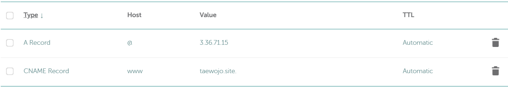
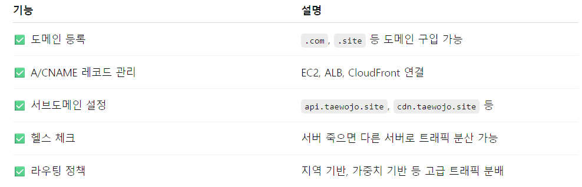

# DNS

- 도메인 이름(naver.com)을 실제 IP주소(1.12.123.45)로 바꿔주는 시스템

## DNS record

- 도메인을 어디에 어떻게 연결할지에 대한 설정 정보
- 종류가 되게 많은데.. 가장 대표적인 두 개만 보면,
  - A
    - 도메인을 IP주소로 연결
    - DNS의 핵심
  - CNAME
    - 도메인을 다른 도메인으로 연결
    - www.naver.com -> naver.com
- Namecheap 입력 예시 (`@`는 Root 도메인을 의미함)

## AWS Route53

- AWS에서 제공하는 유료 DNS 서비스

- AWS의 클라우드 서버를 이용할 때 좀 더 편하게 DNS 관련 설정을 관리할 수 있음

  

 