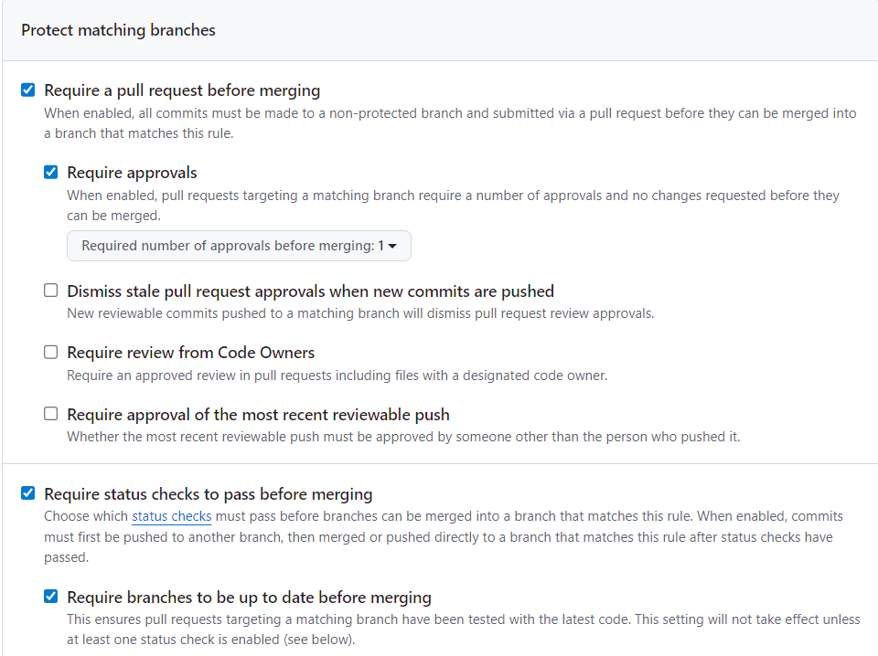

# CI / CD

- 사용하는 언어, 프레임워크 등에 따라 CI/CD 환경 구축을 위한 다양한 tool들이 있는데..
- 일단 Nginx와 Docker container 사용하는 웹서버와 Github Actions를 활용하여 테스트할 것

## 개념

- Continuous Integration
  - 코드를 통합하고 빌드/테스트하는 과정 자동화
- Continuous Delivery / Deployment
  - 배포 준비 단계까지 자동화 or 배포 실행까지 자동화

- CI/CD를 묶어서 얘기하는 경우가 많지만, 개념 구분이 필요
  - CI는 개발 단계에서 사용하는 각 브랜치에도 필요
  - CD는 릴리즈 서버가 연결되어 있는 브랜치에만 필요함

## 목적

- 배포 안정성 향상
- 배포 속도 증가
- 개발 - 운영 협업 효율 증가

## CI/CD Pipeline

1. ##### Trigger 작동

   - commit / push

   - 일반적으로 main branch에 push(merge)가 이뤄지면 pipeline이 작동

   - 따라서 main branch에는 push 불가 등 보호 조건을 걸어둠

2. ##### Build & Test

   - CI server에서 진행

   - github actions의 경우 자동으로 VM을 제공하여 CI server의 역할까지 해줌

3. ##### Artifact 생성

   - docker image

   - `/dist` 폴더(정적 파일 묶음)

   - 압축 패키지(`.zip`, `.tar.gz` 등)

4. ##### CD

   - 배포 준비 또는 배포 실행

## 실습

##### 1. main branch 보호 설정

- 옵션 되게 많은데.. 협업이 잦거나 보안성, 안정성이 중요할수록 켤만한 옵션이 많음. 필요에 따라 체크

##### 2. 브랜치 만들기

- 지금은 main branch 하나밖에 없으니까, local에서 branch 만들기
- `git switch dev`

