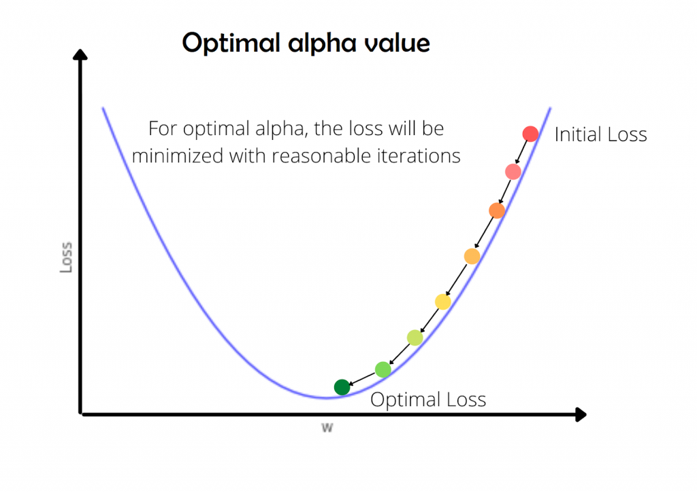
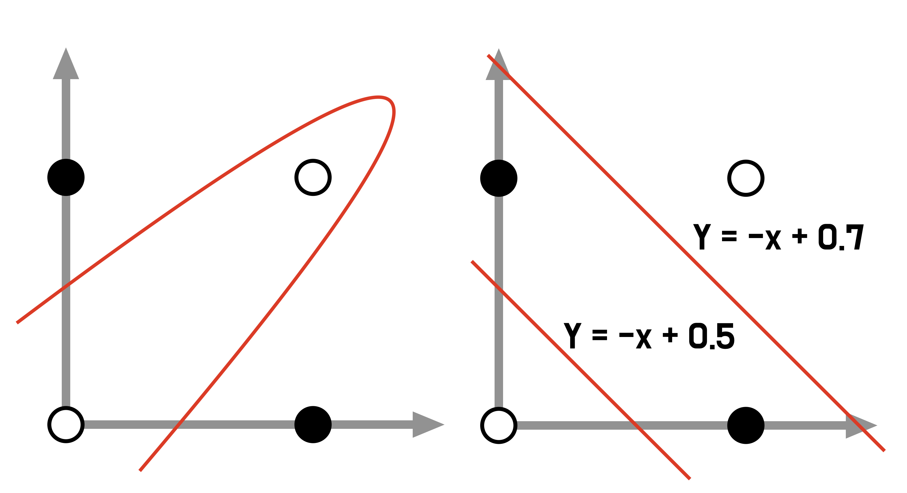

# AI 개론 : AI, 이 정도는 알아야 한다!

## Warm-up

- 강의안은 크게 보면 `머신러닝의 기초 개념 - 세부 방법론 - 주요 알고리즘 - 딥러닝의 기초 개념 - 주요 알고리즘 - 최신 동향` 순으로 구성되어 있습니다.
- 내용이 매우 많아 세부사항에 깊이 빠지면 전체 구조를 잊기 쉽습니다. '지금 이 얘기가 왜 나온 거지?'라는 의문이 들면, 놓친 부분이 있는 거니까 잠깐 강의를 끊고 질문하여 흐름을 붙잡아 주세요.
- 듣다 보면 그렇게 느끼지 않으실 수도 있긴 한데.. 수식이나 복잡한 메커니즘은 최~대한 제거하고 원리 위주로 내용을 구성하려고 노력했습니다. 이 강의안 정도의 레벨에서 이해가 잘 된다면 SSAFY 정규 수업 내용도 따라갈 수 있을 것이라 생각합니다.
- 최신 모델들 다루고 정보 찾으려면 번역된 한국어보다는 원어에 익숙해지시는 게 좋습니다. 대부분 개념의 원어는 병기해놓았으니 같이 보세요.

## 1. 머신러닝의 기본 개념과 학습 원리

### 머신러닝이란?

- 컴퓨터가 데이터로부터 패턴을 학습하는 기술

- **경험적**으로 얻은 데이터 분포를 기반으로, 새로운 입력의 출력값을 **확률적**으로 추정

### 머신러닝의 종류

* 지도학습(Supervised Learning)

  * 입력 데이터(X)와 그에 대응하는 **라벨(y)을 함께 제공**하여 학습하는 방법
  * 대표 Task : **분류**(Classification) | **회귀**(Regression)

* 비지도학습(Unsupervised Learning)

  * **라벨이 없는 상태**에서 데이터의 패턴이나 구조를 스스로 학습하는 방법
  * 대표 Task : **클러스터링**, **PCA**(차원 축소)

* 강화학습(Reinforcement Learning)

  * 주어진 **환경** 속에서 **행동**에 따른 **보상**을 바탕으로 **누적 보상을 극대화**하며 학습하는 방법
  * 강화학습의 4요소(5요소)
    * Agent : `Environment` 안에서 `Action`을 선택하고 수행하는 주체
    * Environment : `Agent`의 `Action`에 따른 `State`를 변화시키고 `Reward`를 제공하는 결정하는 외부 세계(규칙)
    * (State) : `Agent`가 관찰할 수 있는 현재 상황
    * Action : `Agent`가 특정 `State`에서 취할 수 있는 행동
    * Reward : `Agent`가 선택한 `Action`에 따라 주어지는 피드백(보상 또는 페널티)
  
  * 강화학습이란, `Agent`가 `Environment`의 `State`를 관찰하며 `Action`을 선택하고, 그에 따른 피드백으로 주어지는 **누적 `Reward`를 극대화하도록 학습**하는 방법이라고 정의할 수 있다.
  
  

### 모델의 학습 과정

   * 목표 : 2차 함수인 손실함수에서 극소점을 찾는 최적화 문제

       * **최소제곱법(OLS)** : 왜 손실함수는 오차에 대한 2차함수인가? **손실함수의 정의**
            * 손실은 개별 데이터에 대한 예측값과 실제값의 차이**(오차)의 평균**으로 정의할 수 있음
            * 그런데, 오차는 양수일 수도 있고 음수일 수도 있기 때문에 단순합하면 손실이 상쇄됨
            * 따라서 오차를 모두 양수로 처리한 후 누적합해야 함
                 * 방법 1 : 오차의 **절대값**을 누적합하는 것
                 * 방법 2 : 오차를 **제곱**하여 누적합하는 것
                 * 일반적으로, 예측의 안정성을 위해 **큰 오차에는 더 큰 페널티를 부여하는 제곱 방식**을 사용
                 * 손실함수가 이차함수 형태일 경우 뒤이어 나올 경사하강법을 적용하기도 좋음

       - **경사하강법(GD)** : 어떻게 오차를 줄여나갈 것인가? **손실함수의 최적화 방법**
         - 원래 손실함수의 형태를 알고 있으면, 미분해서 기울기가 0인 지점을 구하면 끝이지만..
         - 우리는 손실함수의 형태를 모르는 상태에서 극소화하고, 원함수의 파라미터를 추정해야 함
         - 일단 원함수에 아무 파라미터나 찍어서 대입해보고, 손실함수를 미분해서 기울기를 계산(순전파)
         - 기울기가 0인 점이 극소점일테니까, 기울기의 부호를 보고 0에 가까워지는 방향으로 파라미터를 업데이트하기를 반복(**학습률 만큼만 업데이트**)
         - 기울기가 0에 가까워질 때까지 충분히 이동하여 손실함수가 가장 작은 지점이, 모델이 추정한 최적의 파라미터가 됨

- **확률적 경사하강법(SGD)** : 경사하강법의 효율적 변형
  - 전통적 경사하강법은 가중치를 한 번 업데이트할 때마다 전체 데이터에 대한 오차를 전부 계산
  - SGD는 **일부 샘플(mini-batch)만 사용**하여 기울기를 근사하여 추정하는 방법
  - SGD의 장점
    - 1회 업데이트하는 데에 필요한 연산이 줄어들어 **빠른 학습 가능**
    - 무작위로 발생하는 noise가 비선형함수의 **국소해(local minima)에 빠질 위험을 줄여줌**

## 2. 머신러닝의 과정

### 데이터 준비 및 가공 (Data Preparation)

* 특성 공학(**Feature Engineering**)
  * 모델이 학습하기 좋은 형태로 입력 데이터(X)를 변형하는 것
  * 일반적으로 모델의 선택과 도메인 지식을 결합하여 수행
  * 특성 공학의 주요 구성 요소
    * 특성 선택 : 불필요하거나 다른 변수와 상관관계가 높은 변수를 제거
    * 특성 변환 : 정규화, 표준화, 로그 변환 등 스케일이나 분포를 변경
    * 특성 인코딩 : 범주형 변수를 수치형으로 변환
    * 파생 변수 생성 : 기존 특성을 조합해 새 특성 생성
    * 차원 축소 : 고차원 데이터를 압축하여 본질적인 정보만 유지

#### Feature Engineering의 주요 요소 중 정규화, 표준화, 인코딩은 조금 더 자세히 설명

* 정규화(Normalization)

  * 서로 다른 스케일을 가진 변수들을 **일정한 범위**로 맞춰주는 과정
  * 스케일이 큰 변수의 영향력이 상대적으로 커지는 현상을 방지하기 위해 수행
  * 범위를 0~1로 맞춰 주는 **Min-Max Scaling**이 자주 활용됨

* 표준화(Standardization)

  * **분포**의 중심(평균)과 폭(분산)을 맞춰주는 과정
  * 분포의 차이에 따라 변수별 영향력이 왜곡되는 현상을 방지하기 위해 수행
  * 평균 0, 표준편차 1로 분포를 통일해주는 **Standardization(Z-score Scaling)**이 자주 활용됨

* 인코딩(Encoding)

  * Label Encoding

    * 각 범주에 정수 번호를 부여하는 방식
    * 사과 : 1, 배 : 2, 바나나 : 3
    * **부여된 정수의 크기(순서)가 학습에 관여**할 수 있음

  * One-Hot Encoding

    * 범주 수만큼 컬럼을 만들어 이진 표현(하나의 컬럼만 1로 표현)
    * 사과 : (1,0,0), 배 : (0,1,0), 바나나 : (0,0,1)
    * 각 범주에 대한 정보가 독립적이기 때문에 **정수의 연속성이 학습에 활용되지 않음**
    * 범주 수가 늘어날수록 연산량이 급격히 증가하는 단점이 있음
  
  * 그 외에 Target Encoding, Binary Encoding 등 다양한 인코딩 방법이 있으나, **One-Hot Encoding을 가장 많이 활용**하게 될 것
  
    

### 모델의 신뢰도 확보 (Model Validation)

* 데이터 분할(Hold-out)

     * 데이터셋을 **학습용과 평가용으로 나누어** 일반화 성능을 검증하는 방법
     * 학습한 데이터를 평가에도 활용할 경우 가진 데이터셋에 과적합(overfit)되어 새로운 데이터에 대한 추론 성능이 떨어질 수 있음
     * 따라서 훈련시에는 평가용 데이터셋을 모델에 입력하지 않고,
     * 훈련 데이터에 대한 평가 지표와 평가 데이터에 대한 평가 지표를 비교하여 과적합의 신호로 활용

* 교차 검증(Cross Validation)

     * 데이터를 여러 번 나누어 훈련과 검증을 반복하는 방법
     * 홀드아웃의 한계점인 무작위성에 의한 편차를 줄이고 평균적인 성능을 정확히 추정
     * 데이터를 K개로 나누어 순서대로 검증하는 **K-Fold** 교차 검증이 대표적이며, 고도화된 다른 방법들도 있음

     

### 모델 성능 평가(Model Evaluation)

- 혼동 행렬(Confusion Matrix)

  | **실제 / 예측**     | **Positive (예측)**     | **Negative (예측)**     |
  | ------------------- | ----------------------- | ----------------------- |
  | **Positive (실제)** | **TP (True Positive)**  | **FN (False Negative)** |
  | **Negative (실제)** | **FP (False Positive)** | **TN (True Negative)**  |

  

- ML의 주요 평가지표

  - **분류 모델**의 주요 평가 지표
    - Accuracy : 전체 중 정답 비율. `(TP + TN) / (TP + TN + FP + FN)`
      - 불균형 데이터셋에 취약함
    - Precision : 예측이 Positive인 것 중 실제로 Positive인 비율. `TP / (TP + FP)`
    - Recall : 실제 Positive인 것 중 예측이 Positive인 비율. `TP / (TP + FN)`
    - F1-score
      - Precision과 Recall의 조화 평균
      - **Precision과 Recall 사이에는 Trade-off**가 있음
      - F1-score는 어느 한 쪽 지표에 치우치지 않은 **종합적인 성능**을 보여줌
    - ROC-AUC
      - ROC curve : X축을 FPR(`FP / (FP + TN)`), Y축을 Recall로 하는 그래프
      - AUC : ROC curve 아래 쪽의 면적
      - 임의의 샘플에 대하여 모델이 Negative보다 Positive에 더 높은 점수를 줄 확률
      - 0~1 사이의 값을 가지며, 1에 가까울 수록 모델의 성능이 좋음을 나타냄
      - **불균형한 데이터셋에서도 모델의 성능을 정확하게 평가**하는 지표
  - **회귀 모델**의 주요 평가 지표
    - (adjusted) R^2 : **결정계수**. 모델이 실제 데이터를 얼마나 잘 설명하는지를 나타내는 지표
    - MSE / RMSE / MSLE / RMSLE : **오차 제곱의 평균**(MSE)과 그 변형(Root, Log 변환) 지표
    - MAE  : 오차 절대값의 평균
    - MAPE : 실제값 대비 예측값의 오차를 **백분율(%) 단위로 평균**한 값

### 규제(Regularization)

- 과적합을 방지하기 위해 학습 도중 손실 함수에 페널티를 추가하는 방법

- 데이터에서 진짜 **의미 있는 신호(특성)에 더 집중**하도록 만들고 원함수의 복잡성을 제한함

- λ(lambda) 값을 통해 규제의 정도를 조절할 수 있음

- 대표적인 규제 방식

  - L1 규제(Lasso)

    - 일부 변수에 대한 가중치를 0으로 만듦
    - 모델이 수행하는, 자동화된 특성 선택으로 볼 수 있음

  - L2 규제(Ridge)

    - 변수들의 가중치 크기를 줄여 영향력이 작은 변수의 효과를 희석시키는 방법
    - 모든 변수가 살아남지만, 가중치가 균형 있게 줄어듦

  - Elastic Net

    - L1(변수 선택 효과) + L2(안정성 부여) 규제의 장점을 결합한 형태
    - L1규제와 L2규제의 비율을 조정하여 복합적으로 활용
    - 실무에서 자주 쓰임

    

### 하이퍼파라미터 튜닝

- 하이퍼파라미터란?
  - 사람이 모델의 학습 과정을 제어하는 외부 설정값
  - 학습률, epoch 수, 규제 강도, k-Fold CV의 k값, 모델별 설정값 등
  - 모델이 학습시 추정하는 파라미터(=모델 파라미터)와 혼동하지 말 것!

- 하이퍼파라미터 튜닝
  - 모델이 과적합되지 않으면서 최대한의 성능을 낼 수 있는 **하이퍼파라미터 조합을 탐색**하는 것

- 대표적인 하이퍼파라미터 튜닝 방식

  - Grid Search
    - 모든 하이퍼파라미터 조합을 전부 탐색하는 방식
    - 데이터와 파라미터 수가 적을 때는 활용 가능하나, 조합이 많아 거의 쓰이지 않음
  - Randomized Search
    - 가능한 조합 중 일부를 무작위로 선택하여 탐색
    - 확률분포에 기반하여 균형 있는 랜덤 샘플링 수행
    - Grid Search에 비해 훨씬 적은 탐색 횟수로도 충분히 좋은 조합 탐색 가능

  - Bayesian Optimization
    - 임의로 선택된 몇 개의 파라미터 조합으로 초기 데이터를 생성하고
    - 그 데이터를 기반으로 파라미터 조합에 대한 모델을 학습 및 추론해나가는 방법
    - 이전 탐색 결과를 바탕으로 **성능이 좋아질 가능성이 큰 조합을 다음 탐색 위치로 선택**하며 탐색해나감
    - 탐색 효율이 높아 리소스 제약이 있는 대부분의 상황에서 가장 효율이 뛰어난 기법
    
  - Optuna
    - Bayesian Optimization을 기반으로 한 하이퍼파라미터 튜닝 라이브러리
    - 자동 pruning 등 기능 최적화가 이루어져 있어 실무에서 자주 사용

## 3. 전통 머신러닝 핵심 알고리즘

### 지도학습

#### 분류 알고리즘

* K-최근접 이웃 알고리즘(**KNN**)
  * 학습 데이터를 모두 저장하고, 새로운 데이터가 들어올 때 모든 데이터포인트와의 거리를 계산한 후 k개의 근접한 데이터포인트를 기반으로 라벨을 분류하는 알고리즘
  * 구현이 간단하고 학습 과정이 없음
  * 성능이 고르지 않고, 고차원 데이터에 대해 성능이 심각하게 떨어짐

* 로지스틱 회귀
  * 입력변수 X에 대하여 어떤 사건(라벨==특정 값)이 발생할 확률을 추정하는 **분류 모델**

  * sigmoid 함수의 출력값이 `Threshold` 이상이면 1, 아니면 0으로 분류하는 이진 분류를 수행

  * softmax 함수를 활용할 경우 다중 분류도 가능

  * 모델이 단순하고 빠르지만, 비선형 관계는 잘 추론하지 못함

* 서포트 벡터 머신(**SVM**)
  * 서포트 벡터(일부 데이터포인트)를 가장 잘 분리하는 n-1차원 초평면을 찾아내 최적해(가중치)를 추정하는 방법

  * margin(서포트 벡터와 초평면 사이의 최단 거리)의 합을 극대화하는 초평면 탐색

  * 성능이 뛰어나고 안정적이지만 대규모 데이터셋에서는 느림

* 결정 트리(**Decision Tree**)

  - 루트 노드에서 트리 구조로 뻗어나가면서, 불순도(노드 안에 서로 다른 클래스가 섞여 있는 정도)를 최대한 줄일 수 있는 feature의 조합을 선택하며 학습
  - 모델이 알아서 변수를 선택하고 조합하기 때문에 대부분의 전처리 과정이 불필요
  - 인간의 직관으로 모델의 학습 과정을 이해할 수 있음
  - 그러나 **과적합에 매우 취약**하여 단독 트리보다는 앙상블 기법으로 확장
  
  

#### 회귀 알고리즘

- 선형 회귀
  - 수치형 데이터를 가장 잘 설명하는 하나의 **직선**(또는 초평면)을 찾는 알고리즘
  - 경사하강법을 통한 손실함수 최적화를 통해 가중치 추정
  - 변수 간 다중공선성이 있는 경우 성능이 안정적이지 않음

- Ridge / Lasso / ElasticNet 회귀
  - 선형회귀에 L1, L2, ElasticNet 규제를 추가한 형태(2장 `Regularization` 참고)
  - feature 간 상관관계가 높은 데이터에 대해 강력한 성능

- SVR
  - SVM의 개념을 회귀에 적용
  - 초평면을 이루는 가중치를 추정하여 회귀선(초평면)을 찾음

- Decision Tree Regressor
  - Decision Tree의 개념을 회귀에 적용
  - 노드를 나누는 기준을 MSE 감소량으로 하여 노드 내의 분산을 극소화하는 방향으로 학습

#### 앙상블(Ensemble) 기법

* **여러 모델을 결합**하여 더 성능이 좋은 하나의 모델을 만드는 방법

* 분류와 회귀 등 여러 Task에 적용할 수 있음

* 배깅(Bagging)
  * 같은 알고리즘 여러 개를 병렬로 학습하고 평균(회귀) 또는 투표(분류)로 예측
  * Random Forest 등
  * 같은 모델을 여러 개 사용하는 방식이라 다양성이 부족

* 부스팅(Boosting)
  * 같은 모델의 오류를 보완하면서 순차적으로 여러 번 학습
  * XGBoost, LightGBM, CatBoost 등
  * 성능은 뛰어나지만 상대적으로 과적합 위험이 높음

* 보팅(Voting)

  * 서로 다른 종류의 모델을 동시에 학습시켜 평균(회귀) 또는 투표(분류)로 예측
  * **학습 방식이 아니라 결과 결합 방법**
  * 배깅·부스팅과 배타적인 개념이 아니며, 배깅·부스팅 모델과 병행 사용 가능한 전략

  

### 비지도학습

#### 주성분 분석(PCA)

- 데이터의 정보량을 보존하면서 **차원을 축소**하는 기법
- 노이즈를 제거하고 연산 효율을 늘릴 수 있음
- PCA의 내부 동작 방식
  - 다차원 공간에서 데이터의 변동이 많은 방향(=정보가 많은 축)을 찾아 주성분으로 선택
  - 하이퍼파라미터인 `n_components`개의 주성분을 찾을 때까지 위 과정을 반복

#### 군집화(Clustering)

- 라벨이 없는 데이터를 서로 비슷한 특성을 가진 군집(Cluster)으로 묶는 방법

- 거리가 가까운 데이터포인트들끼리 묶어냄

- 대표적인 클러스터링 기법
  - K-Means
    - K개의 중심점을 만들어 각 데이터가 어느 중심점에 가장 가까운지에 따라 군집화

    - 군집에 들어온 데이터포인트들의 평균점으로 중심점을 갱신하며 학습

    - 군집의 수를 미리 정의해야 하므로 과소/과대 군집화가 발생하기 쉬움

    - 초기 설정에 따라 결과가 달라질 수 있어 불안정
    
  - DBSCAN
    - 데이터가 몰려 있는 곳은 군집, 아닌 부분은 노이즈로 간주하는 **밀도 기반 클러스터링**
    - 한 데이터포인트를 기준으로 하여 반경 내에 충분히 많은 데이터가 발견되는 영역을 탐색하여 군집화
    - 기준이 되는 dense에 미치지 못하는 영역에 있는 데이터포인트들은 이상치 처리
    - 노이즈 및 이상치 처리, 공간 데이터 처리에 강한 알고리즘

##### 오늘은 지도/비지도학습과 더불어 ML의 한 축인 강화학습에 대한 내용은 생략합니다!

## 4. 딥러닝의 발전

### 단층 퍼셉트론의 한계와 극복

* 단층 퍼셉트론의 한계

  * 복잡한 비선형 데이터 처리의 어려움

    * 입력에 대한 **단순한 선형 조합**으로만 데이터를 처리
    * 특성(feature)을 사람이 직접 정의해야 함

  * XOR 게이트

    * 두 입력이 다르면 0, 같으면 1을 반환하는 논리 연산
    * 하나의 직선으로 데이터를 분리해낼 수 없음

    

    

* **다층 퍼셉트론(MLP)**으로의 진화

  - 여러 개의 퍼셉트론을 다층(multi-layer)으로 쌓아 구성한 인공 신경망 구조
  - 입력층-은닉층-출력층의 구조
  - 각 은닉층에서의 가중치 계산은 단층 퍼셉트론과 같이 선형 변환으로 이루어지지만,
  - 비선형 **활성화함수**를 사용하여 다음 층으로 값을 전달할 때 입력공간을 **비선형 변환**함
  - 층을 지나면서 모델이 스스로 특성을 변환하고 조합하며 학습

  

### 딥러닝은 어떻게 학습하는가?

* 활성화 함수(Activation Function)

  * 각 퍼셉트론의 출력값을 다음 층으로 전달하는 함수
  * 은닉층에서는 출력값을 **비선형 변환**하여 복잡한 관계를 학습하게 함
  * 출력층에서는 task에 따라 적절한 **출력값으로 변환**해주는 역할(이진 분류, 다중 분류, 회귀 등)

* 주요 활성화 함수

  * Sigmoid
    * 출력을 0~1로 제한하여 **확률 해석**에 유용
    * 확률 예측 및 이진 분류(`Threshold` 이상이면 True)에 적합
    * 양 극단에서 기울기가 0으로 수렴하여 **기울기 소실** 문제가 발생하므로 은닉층에서는 거의 사용되지 않음
    * **이진 분류** task의 출력층에서 활용
  * Softmax
    * 출력을 확률 분포로 변환
    * **클래스별 확률값**을 반환하며 모두 더하면 1인 형태
    * **다중 분류** task의 출력층에서 활용
  * ReLU
    * 은닉층에서 **학습용으로 가장 많이 활용**되는 함수
    * 계산이 단순하여 학습이 빠르면서도 기울기 소실 문제가 완화되어 성능이 좋음
    * 음수 입력을 모두 0으로 처리하여 **Dead ReLU** 문제가 발생할 수 있음
      * Leaky ReLU 등 변형된 활성화함수를 사용하여 개선 가능
  * 항등함수 `y=x`
    * 입력층에서 최초 입력값을 **그대로 은닉층에 전달**하기 위해 사용
    * **회귀** task에서 출력층에서 활용
    * `활성화함수를 사용하지 않는다.`라고 표현하기도 함

* 손실 함수(Loss Function)

  * 모델의 예측값과 실제 정답값의 오차를 표현하는 함수
  * 손실 함수 최적화(극소화)가 곧 **모델 학습의 목표**가 됨
  * 모델의 **평가 지표**로도 사용

* 주요 손실 함수

  * **MSE**, MAE 및 그 변형(Root, Log변환) : 회귀용 손실 함수
  * **Binary** Cross Entropy : 이진 분류용 손실 함수
  * **Categorical** Cross Entropy : 다중 분류용 손실 함수

* 역전파(**Backpropagation**)

  * 각 가중치가 순전파를 통해 계산된 예측 **오차(Loss)에 얼만큼 기여했는지**를 계산하는 방법
  * 합성함수의 미분법(Chain rule)을 통해 기울기를 역산
  * 경사하강법을 통해 가중치를 업데이트하는 데에 활용됨

* 기울기 소실**(Vanishing Gradient)** 문제

  * 역전파 과정에서 층을 거슬러 올라갈수록 기울기가 작아져 0으로 수렴하는 현상
  * 은닉층 활성화함수의 미분값이 1보다 작기 때문에 **층이 깊어질수록** 입력층에 가까운 은닉층에서의 **가중치가 0으로 수렴**
  * 그 결과 앞쪽 은닉층에서의 가중치 업데이트가 거의 이루어지지 않고 진동함
  * ReLU 사용, 적응형 학습률 적용, 가중치 초기화, 배치 정규화 등의 기법으로 완화

  

### 딥러닝 모델 최적화(Optimizing)

- 모델의 학습 효율을 높이는 방법 = **손실함수 최적화의 속도와 안정성**을 높이는 방법

- 주요 최적화 기법

  * 적응형 학습률(Adaptive Learning Rate)
    * 각 가중치마다 변화량의 scale이 다르므로, **파라미터별로 다른 학습률을 동적으로 적용**하는 방식
    * 학습 과정에서 각 층에서의 파라미터별 변화 이력을 추적하여 학습률을 조정
    * 층마다 적절한 학습률을 연산 및 적용하여 기울기 소실 문제 완화

  * 모멘텀(Momentum)
    * 이전 단계들에서의 가중치 업데이트 방향과 속도에 따른 **관성**을 부여하는 기법
    * 이전에 기울기가 급했으면 빠르게, 기울기가 완만했으면 느리게 업데이트하며 학습 속도를 조정

* 주요 Optimizer
  * SGD
    * 데이터의 일부에 대해서만 경사하강법을 적용하는 기법(1장 `SGD` 참고)
    * 모든 최적화의 뿌리가 되며, 구현이 간단하고 빠름
    * 모멘텀 기법을 따로 적용해서 쓰기도 하지만.. 더 좋은 Optimizer가 많아서 실무에서 활용하는 상황은 별로 없음
  * Adam|AdamW
    * 적응형 학습률, 모멘텀을 결합해 만든 **현대 딥러닝의 표준 Optimizer**
    * Optimizer 하이퍼파라미터를 튜닝하지 않고 기본값으로 두어도 대부분의 상황에서 성능 우수
    * AdamW는 Adam의 개선된 버전
    * **잘 모르겠으면 어떤 상황이든 그냥 얘네 쓰면 99% 잘 된다!**

### 딥러닝 모델 개선 기법

- 모델의 구조 또는 학습 환경 자체를 개선하여 일반화 성능을 높이는 방법

- 주요 모델 개선 기법

  - 가중치 초기화(Weight Initialization)

    - 기울기가 너무 작으면 기울기 소실, 너무 크면 기울기 폭발 문제가 발생할 수 있음
    - 학습의 안정성을 높이기 위해 **각 은닉층에서 가중치를 초기화**하는 기법

    - 주요 초기화 방식
      - Xavier Initialization : **비 ReLU 계열에서 표준적으로 사용**되는 초기화 기법
      - He Initialization : Xavier Initialization을 ReLU의 구조에 맞게 변형한 초기화 기법. **ReLU 계열 활성화함수 사용시 표준적으로 사용**됨

  - 배치 정규화(Batch Normalization)

    - 각 은닉층에서 입력값의 분포가 변하면 학습 안정성이 떨어짐
    - 층별 입력 분포를 일정하게 유지하기 위해 mini-batch 단위로 **입력의 평균과 분산을 정규화**하는 기법

  - 드롭아웃(Dropout)

    - 딥러닝을 위한 **규제** 기법
    - step마다 무작위하게 **일부 뉴런을 비활성화**(가중치=0)하여 서로 다른 데이터 조합으로 학습
    - 과적합을 방지하여 일반화 성능을 높임

  - 조기 종료(Early Stopping)

    - **학습 중간**에 주기적으로 검증용 데이터를 통한 손실을 측정하고 모델 성능을 평가하여, 성능이 떨어지기 시작할 때 학습을 중단하는 기법
    - `val_loss`(검증 데이터에 대한 손실)의 증가를 과적합의 신호로 봄

  - 데이터 증강(Augmentation)

    - **원본 데이터의 형태를 변환**한 새 데이터를 생성하여 데이터의 양을 늘리는 기법
    - 데이터 입력이 다양해져 과적합이 방지되고 일반화 성능 향상
    - 일반적으로 데이터 양이 적을 경우 더 효과적
    - 데이터가 충분히 많거나 증강이 원본 데이터를 왜곡하는 경우 역효과를 일으킬 수 있음
    - **노이즈 추가, 이미지 회전, 음성 배속** 등 원본 데이터의 속성을 잃지 않도록 하는 패턴 변조

    

##  5. 분야별 핵심 딥러닝 아키텍처

   * CNN(Convolutional Neural Network)
     * 주로 이미지 데이터가 가진 **지역적 특징**을 추출하여 학습하는 방식
   * RNN(Recurrent Neural Network)
     * 데이터의 **시간적 순서**를 고려하기 위해 순서 정보(sequence data)를 함께 학습하는 방식
   * LSTM(Long Short-Term Memory)
     * 초기 NLP 모델의 기본 구조
     * RNN에서 발생하는 기울기 소실 문제를 개선한 메커니즘
     * 그러나 context가 길어질수록 장기 의존성 문제는 여전히 나타남

- 어텐션(Attention) | 트랜스포머(Transformer)

   * 입력값 전체에서 토큰 간 관계성을 계산하고, **중요한 토큰들에 높은 가중치를 부여**하며 학습하는 방식
   * 자연어 처리(NLP)를 위해 개발된 아키텍쳐지만, 여러 task의 모델들에 활용되고 있음
   
   

## 6. 딥러닝 최신 동향

- 전이학습(사전 학습 + Fine tuning)

  - 대규모 데이터셋으로 이미 학습된 모델을 새로운 데이터셋과 수행하려는 task에 맞게 미세 조정(Fine tuning)하는 방법

- 파운데이션 모델 활용

  - LLM, SLM : 거대 언어 모델, 경량화된 거대 언어 모델의 성능과 **범용성**이 높아져 널리 활용됨
  - multi-modal : **여러 형태의 데이터**를 동시에 처리할 수 있는 모델 또는 플랫폼 발달
  - 증류 학습 : 큰 base 모델의 **학습과정과 출력값을 작은 모델에 전달**하여 효율적으로 학습하는 방식

- 여러 task에 Transformer 통합

  - **Transformer**는 NLP용으로 개발된 구조였으나, 다른 형태의 데이터들에도 높은 성능을 보임
  - 이미지, 음성 등 데이터 처리 시에도 Transformer의 메커니즘을 병합한 모델을 사용하여 성능 개선

- LLM 활용 기술

  - RAG(Retrieval-Augmented Generation)

    - 실시간 데이터, 참조할 내부 자료 등을 Vector DB에 저장하고 LLM이 Vector **검색 결과를 기반으로 응답을 생성**하도록 하는 방식

  - Agent

    - **웹 검색, 함수 호출, 코드, 앱** 등 tool을 정의하고 LLM이 필요한 **tool을 스스로 실행**하는 구조

  - CoT

    - 프롬프팅 기법으로, **단계별 추론 과정을 거쳐 응답을 생성**하도록 하여 응답 품질을 높임
    - 최신 LLM에는 대부분 내장되어 있어 추가 프롬프팅은 불필요한 경우가 많음

    

## 강의 마무리

- 내용이 굉장히 많고, 개념들 간의 관계를 한 번에 파악하기 어려울 수 있습니다.
  - 핵심 키워드 위주로 복습하며 AI의 발전 과정과 주요 개념들을 자신의 언어로 번역해보세요.
  - 실제 모델을 활용하여 개발하는 과정 중에도 해당 모델과 관련된 개념들을 다시 보시면 기능 설계에 대한 인사이트를 얻을 수 있습니다.
- 이 정도는 알아야 다음 단계로 넘어가 주요 모델별 메커니즘이나 특징, 활용법 등을 이해하고 학습할 수 있습니다.
  - 내용이 생각보다 많지만, 원래 그렇습니다. 이것도 줄이고 줄인 겁니다.

  - 시간을 충분히 들여 넓게 이해하고 그걸 기반으로 SSAFY 정규 강의도 더 깊이 이해해봅시다.

- 시간상 생략하거나 크게 압축한 주제들이 있으니 추가 학습도 필요합니다.
  - 특히 강화학습, 주요 딥러닝 아키텍쳐(5장), 최신 동향(6장)이 다이어트가 많이 되었습니다.

  - Attention과 Transformer는 NLP 뿐만 아니라 거의 모든 task에서 범용적으로 활용되는 추세이므로, 메커니즘과 장점, 한계 등을 깊이 있게 학습해보세요.

- `"AI 이론 기반 없어도 프레임워크 다루고 모델 돌릴 줄 알면 되는 거 아닌가?"` 싶을 수 있는데..
  - 그럼에도 불구하고 최소한의 개념을 학습해야 하는 이유가 있습니다.
  - 오늘 살펴본 모델 활용법이나 최적화 기법들을 실제로 적용하려면..
    - task나 모델의 종류에 따라 필요한 것도 있고 아닌 것도 있습니다.
    - 모델에 이미 내장되어 있는 것도 있고 아닌 것도 있습니다.
    - 하이퍼파라미터 값을 입력해야 하는 것도 있고 아닌 것도 있습니다.
    - 여러 종류의 모델이나 외부 tool을 chaining해야 할 수도 있습니다.
  - 모델 하나를 돌리는 건 어렵지 않지만, 서비스를 설계하기 위해서는 위와 같은 판단들을 스스로 할 수 있어야 합니다. 그러기 위해서 각 task, 기법이나 모델에 대한 최소한의 이해가 필요할 것입니다.
  - 그래서 오늘 수업의 목표는, 여러분이 모델을 작동시키기 전에, `"왜 그렇게 해야 하는가?"`에 대해 대답할 수 있는 개발자로 성장하기 위한 초석을 닦아드리는 것이었습니다.
  - 개념을 공부할 때는 그 활용법을 함께 바라보시고, 개발을 할 때는 다시 개념을 돌아보며 배워나갑시다. 긴 시간 수고하셨습니다!

