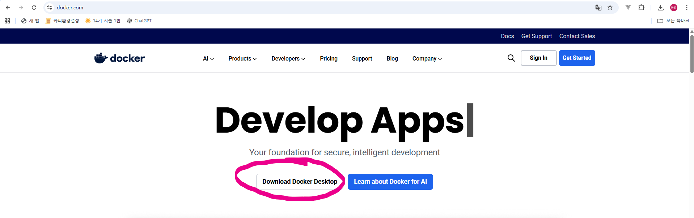
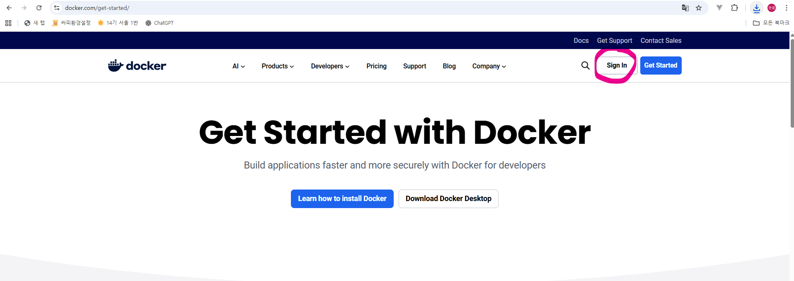

# Docker Desktop 설치 가이드

- 윈도우 OS 환경을 가정한 Docker Desktop 설치 가이드입니다.

- https://www.docker.com/

## 설치

### 1. Download Docker Desktop 클릭

### 2. WSL2 옵션 체크하고 설치

## DockerHub 회원가입

### 1. Sign in 클릭

### 2. Sign up 클릭 후 회원가입 진행

