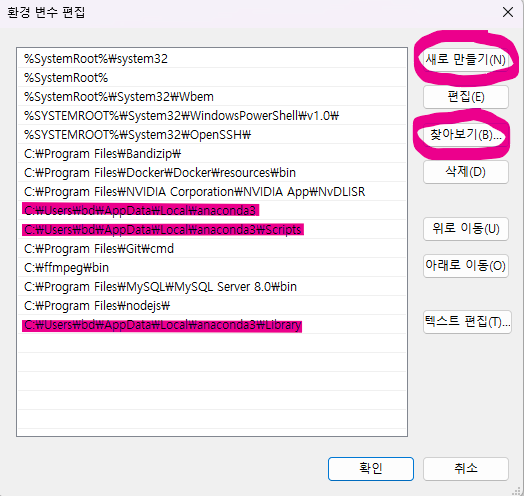

# Miniconda 설치 가이드

- 윈도우 OS 환경을 가정한 Miniconda 설치 가이드입니다.

- https://www.anaconda.com/

## 설치

### 1. **Free Download 클릭**

### 2. **Skip registration 클릭**

### 3. OS에 맞는 Miniconda installer 다운로드

### 4. 설치파일 실행 후 기본 옵션으로 설치 진행

## 환경 변수 등록

### 0. 주의사항

- `conda`와 `Python`을 독립적으로 설치하고 각각 환경 변수에 등록한 경우, 환경 변수에 먼저 등록된 버전의 Python이 우선 실행됩니다.

- `base` 환경에서 특정 버전의 Python이 필요한 경우에는 참조되는 Python 경로 및 버전을 잘 확인하고 사용하세요.

### 1. **시스템 환경 변수 편집 검색 및 실행**

### 2. 고급 탭 - 환경 변수 클릭

### 3. 사용자 변수 or 시스템 변수 Path를 선택한 후 편집 클릭(둘 중 하나만 하세요!)

### 4. 새로만들기 또는 찾아보기 클릭 후 세 개의 경로 추가

- `miniconda3`과 그 하위에 있는 `Scripts`, `Library` 디렉토리 등록(참고 사진은 anaconda 기준)
- 사용자 이름 및 conda 설치 경로에 따라 경로가 달라지니 주의하여 등록

## Conda-forge 채널 등록

- conda 설치 확인

  `conda --version`

- conda-forge 채널 등록

  `conda config --add channels conda-forge`

  `conda config --set channel_priority strict`

- 설정 확인

  `conda config --show channels`

  `conda config --show channel_priority`