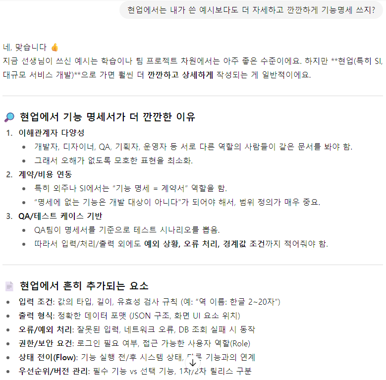

# 기능 명세서 작성 피드백

- 팀이 작성 중인 기능 명세서 가볍게 읽어보고 댓글로 피드백 남김


## 피드백 내용

1. 어떤 요구사항은 사용자 중심으로, 어떤 요구사항은 시스템 중심으로 기술되어 있습니다. 기능의 특성상 톤을 맞추어 쓰기 어려운 케이스가 아니라면, 팀원 간 합의를 통해 한 쪽으로 통일해주세요.

2. 기능별 중요도와 구현 난이도를 생각해보시고, 이를 기반으로 우선순위도 작성해주세요. 여기서 작성한 우선순위가 그대로 개발 순서가 됩니다.

3. 기능에 따라 조금씩 달라질 수 있지만, 일반적으로 기능의 실행은 1) 사용자의 입력 2) 시스템의 작업 처리 3) 사용자에게 출력의 순서로 이루어집니다.

- 지금 작성된 요구사항들은 대부분 이 중 일부만 포함하고 있고, 특히 ‘작업 처리’에 해당하는 부분이 거의 작성되어 있지 않습니다.

- 예를 들어, 사용자가 특정 역 정보를 검색하는 기능을 떠올려본다면,

  ```markdown
  1) 사용자는 한글로 역 이름을 입력하고 검색 버튼을 클릭한다.
  2) 시스템은 DB에서 입력된 역 이름을 통해 해당 역의 정보(에스컬레이터 위치, 화장실 위치, 출구별 위치, … 등등 전부 작성)를 조회하고 출력하기 위한 형태로 가공한다.
  3) 화면에는 호선별 지정된 색으로 역 이름과 기본 정보(OOO, OOO, OOO)가 카드 리스트 형식으로 출력되고, 해당 위치를 한 번 더 클릭하면 표 형식으로 상세 정보(기본 정보 + OOO, OOO, OOO)가 출력된다. 
  ```

  위와 같이 작성할 수 있습니다. 여건상 완벽하게 쓰지는 못하더라도, 다른 팀원들 작성한 내용 확인하면서, 그 중에 잘 쓰인 것 위주로 내용과 톤을 통일해서 작성해주시면 개발할 때 혼선이 줄어듭니다.


## 추가 답변 by GPT




## 소감

- 내가 4개월 배우고 프로젝트 할 때도 이것보다 훨씬 못 썼는데, 아직 2개월, 그것도 문법이랑 알고리즘만 배운 학우들에게 그 이상을 요구하는게 좀 민망하긴 하다.
- 다들 워낙 욕심도 많고 능력도 뛰어나서 아웃풋이 바뀌는게 금방 눈에 띄고, 놀라움 반 감사함 반 느끼며 가이드하는 중
- 이렇게 아는 척 가르쳐 놓고 나중에 내 프로젝트 때 대충대충 쓰고 개판 치지 않으려면 더 많은 준비와 노력이 필요할 것 같다.
- 오늘도 30분 정도 짧게 팀 회의 했는데, 큰 특이사항은 없어서 내 공부 하면서 한쪽 귀만 열어놓고 회의 내용 들었다.
- 회의 중에 ERD 설계 어떻게 시작해야 하는지 물어보셔서 내가 아는 선에서 가볍게 조언해드렸다.
  - 1:1, 1:N, N:M 관계 설정과 PK, FK 지정에서 애를 먹는 경우가 많으니 그 부분 중심으로 개념 훑어볼 것
  - 개념 조금 알 것 같다 싶으면, 가장 중요한 Entity 2~3개 만들고 그 Entity 사이의 관계를 먼저 설정하고, 필요한 컬럼 채워 넣은 후 그 테이블들을 중심으로 Top-Down 방식으로 뻗어나가며 설계할 것
  - 그러다가 막히면 유튜브 강의나 비슷한 프로젝트의 모범 예시 찾아보면 도움이 될 것
  - 기능 명세서 보면서 그 기능들을 구현하기 위해 어떤 데이터가 필요하고 어떻게 연결되어 있어야 하는지 대조해보며 설계할 것
  - (나를 포함해서) 우리 같은 초보에게는 원래 어렵고 막막하고 힘든 작업임.. 화이팅


## 참고 : 피드백 전 기능명세서(작성중)

| 담당 | 기능 구분                 | 세부 기능                                         | 설명                                                         | 비고                                   |
| ---- | ------------------------- | ------------------------------------------------- | ------------------------------------------------------------ | -------------------------------------- |
|      | 회원 정보 (가입 / 로그인) | 계정 생성                                         |                                                              |                                        |
|      | 회원 정보 (가입 / 로그인) | 로그인 / 로그아웃                                 |                                                              |                                        |
|      | 회원 정보 (가입 / 로그인) | 계정 찾기                                         |                                                              |                                        |
|      | 회원 정보 (가입 / 로그인) | 약관/개인정보 처리 동의 관리                      |                                                              |                                        |
|      |                           | 구글 약관 동의                                    | 구글로 처음 로그인하는 경우, 브라우저로 넘어가 OAuth 권한에 동의합니다.<br>구글 계정 생성 시: 구글 서비스 약관 + 개인정보처리방침 동의 (이미 완료된 상태)<br>OAuth 권한 승인 시: "앱이 내 정보에 접근하는 것"에 대한 동의가 진행됨 |                                        |
|      |                           | 이메일 약관 동의                                  | 서비스 이용약관, 위치 정보 이용약관, 개인정보 동의 약관에 필수적으로 동의합니다.<br>구글 회원가입의 경우 앱 사용 시 ‘위치 사용 권한’ 승인을 받고, 이메일 회원가입의 경우 약관 동의 시 같이 동의를 받는다. |                                        |
|      | 사용자 설정 (마이페이지)  | 음성 설정                                         |                                                              |                                        |
|      | 사용자 설정 (마이페이지)  | 경로 안내 설정                                    | 1. 에스컬레이터 우선 경로<br>2. 최소 환승<br>3. 최단 시간    |                                        |
|      | 사용자 설정 (마이페이지)  | 접근성 설정                                       |                                                              |                                        |
|      | 사용자 설정 (마이페이지)  | 즐겨찾기 & 최근 경로                              |                                                              |                                        |
|      | 길찾기 (출발역 / 도착역)  | 출발역 도착역 입력(텍스트)                        | 사용자로부터 한글로 출발역과 도착역을 각각 입력받습니다.<br>출발역: [ ]<br>도착역: [ ] | 한글 입력, 출발역과 도착역 별도로 입력 |
|      | 길찾기 (출발역 / 도착역)  | 텍스트 입력 정보 후처리                           | 입력값과 유사한 역 이름을 노출하여, 사용자가 역을 선택하고 확정할 수 있도록 합니다.<br>사용자 입력을 기반으로 유사한 역을 추천(검색 자동완성) → 유효한 역 입력 유도 |                                        |
|      | 길찾기 (출발역 / 도착역)  | 출발역 도착역 입력(음성)                          | 텍스트 입력 칸 옆 마이크 버튼 클릭 → 발화 수집<br>음성 안내: “출발역과 도착역을 말씀해주십시오”<br>화면: 예시 발화(“강남역에서 신도림역으로 가는 길을 안내해 줘”) 표시 |                                        |
|      | 길찾기 (출발역 / 도착역)  | 음성에서 유효한 값 추출                           | LLM에 사용자 발화를 입력하고 출발역과 도착역을 추출.<br>“출발역: 000, 도착역: 000” 형식으로 가공. |                                        |
|      | 길찾기 (출발역 / 도착역)  | 음성에서 유효한 값 추출                           | LLM으로부터 받은 데이터를 텍스트 입력 칸에 자동 입력 → 사용자가 확인 |                                        |
|      | 길찾기 (출발역 / 도착역)  | 음성에서 유효한 값 추출                           | 유효하지 않은 입력(노이즈, 없는 역 등)은 다시 음성 입력 단계로 돌아감 |                                        |
|      | 길찾기 (출발역 / 도착역)  | 길찾기 입력 완료                                  | “길찾기를 시작합니다” 버튼 클릭 시 경로 안내 시작.<br>사용자가 입력 확인 |                                        |
|      | 경로 안내 (스토리 카드)   | 스토리 카드 진행                                  | 메인페이지에 경로 안내 카드 표시(서브페이지 아님).<br>상단: 출발역→도착역 라인 시각화 + 현재 위치 아이콘 + 소요시간<br>중앙: 경로 안내 지시문<br>우측: [음성 재생] [다음 경로] [편의 시설] [경로 이용 불가] 버튼 | 일관된 화면 구성                       |
|      | 경로 안내 (스토리 카드)   | 경로 안내 시작                                    | “경로 안내가 시작됩니다” 음성 자동 재생 후 첫 지시문 재생    |                                        |
|      | 경로 안내 (스토리 카드)   | 음성 재생 버튼                                    | 사용자가 지시문을 다시 들을 수 있음                          |                                        |
|      | 경로 안내 (스토리 카드)   | 다음 경로 안내                                    | 현재 지시문 이행 후 [다음] 버튼으로 다음 카드로 이동 (인스타 스토리 방식) |                                        |
|      | 경로 안내 (스토리 카드)   | 편의 시설 확인                                    | [편의 시설] 버튼 클릭 → 여정에 포함된 모든 역의 편의 시설 정보 확인.<br>특정 역 버튼 클릭 시 해당 역의 상세 정보 확인 |                                        |
|      | 경로 안내 (스토리 카드)   | 선택 역의 편의시설 정보 안내                      | 특정 역 버튼 클릭 시 위치별 편의 시설 안내 텍스트 제공 (출구 표지판 등 활용) |                                        |
|      | 경로 안내 (스토리 카드)   | 임시 폐쇄 대응                                    | [경로 이용 불가] 버튼 클릭 시 현재 위치에서 새로운 최적 경로 탐색 |                                        |
|      | 경로 안내 (스토리 카드)   | 목적지 도착 안내 종료                             | 마지막 카드에서 [안내 종료] 버튼 표시 (기존 [다음] 버튼 위치 교체) |                                        |
|      | 경로 안내 종료            | 길찾기                                            | 경로 안내 종료 시 처음 [경로 입력] 카드로 전환               |                                        |
|      | 역 정보 (단일역)          | 역 검색                                           | 사용자가 역 이름 입력 → 자동완성 리스트 노출 → 선택 시 상세 정보 제공.<br>예: “여의” 입력 → “여의도”, “여의나루” 자동완성 표시 |                                        |
|      | 메인페이지                | 화면 구성 참고용                                  |                                                              |                                        |
|      | 네비게이션 바             | 로그인/로그아웃<br>회원 정보<br>길찾기<br>역 정보 |                                                              |                                        |
|      | 배너                      |                                                   |                                                              |                                        |
|      | 길찾기 (출발역 / 도착역)  |                                                   |                                                              |                                        |

