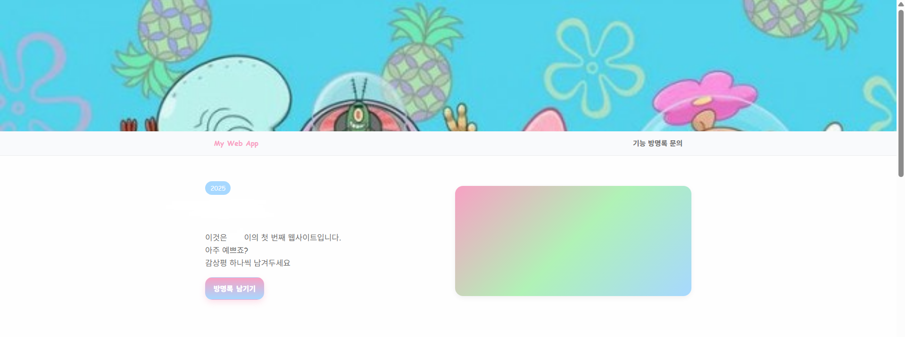
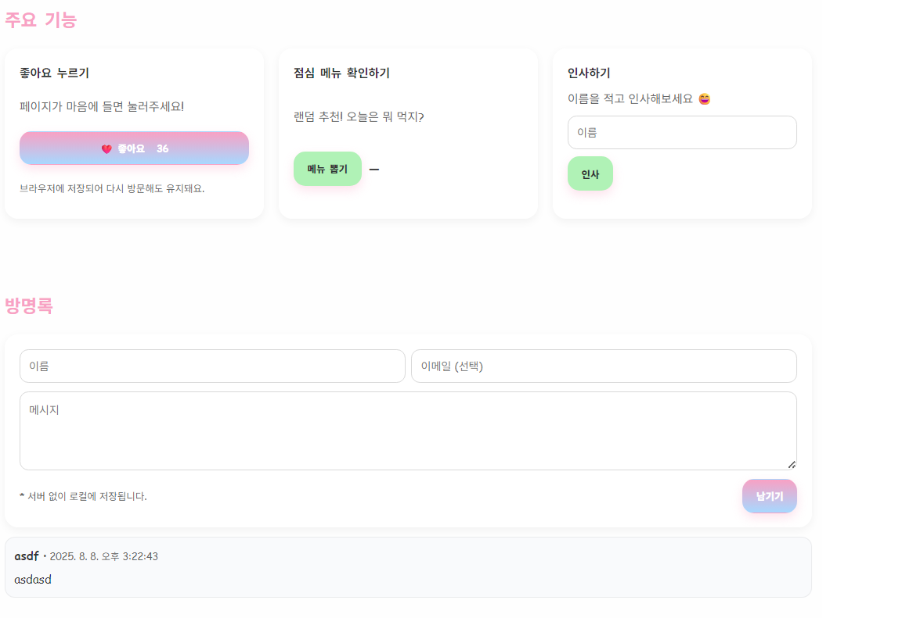

# DNS

- IPv4 주소로 어떻게 접속까지는 했는데..
- 주소가 너무 못 생겼다.
- 나는 주소에 `naver.com` 처럼 예쁜 이름을 달아주고 싶어! -> **Domain Name System**

##### 근데.. DNS 자체는 얕게만 알아도 당장 쓰는데 큰 무리가 없어서, 개념 설명은 짧고..

##### 여태 배운 것들 바탕으로 실습을 주로 하면서 여태 배운 내용들을 전체적으로 리마인드하겠습니다.

##### 실습 내용

- GPT한테 개인 페이지 html 작성해달라고 요청해서 코드 받음

- server.py에 fastapi 실행코드 넣어서..

- docker image build -> tag -> push -> pull -> run

- IPv4 주소로 서버 접속 확인

- curl 명령어 사용

- namecheap에서 도메인 구매

- namecheap DNS 설정

- domain을 통한 서버 접속 확인

  

  