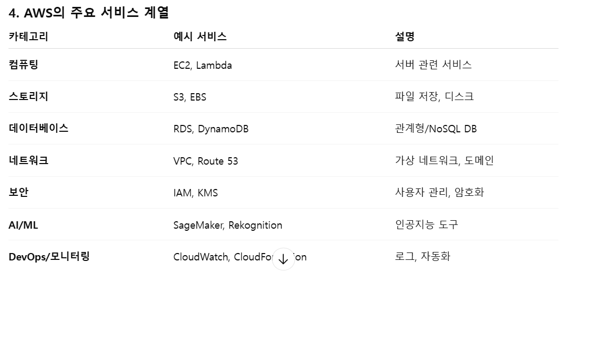

# AWS

## 선수 지식

- 클라우드, VM, 서버 등의 개념에 대한 이해가 부족한 경우에도 수강은 가능하나, 추가 설명 필요

## 학습 목표

- AWS가 제공하는 주요 서비스들이 무엇인지 말할 수 있다.
- Root 계정에서 IAM 사용자를 생성하고 적절한 권한을 부여할 수 있다.
- Root 계정과 IAM 계정을 구분하여 접속하고 필요한 서비스를 검색할 수 있다.

## Warm-up

- 지난 시간에는 Docker를 통해 Image로 앱을 포장하고 배포하는 방법을 배웠습니다.

- 배포된 이미지를 Container로 실행시키고 서비스를 무중단 운영하기 위해서는 24시간 돌아가는 서버 컴퓨터가 필요합니다.

- 곧 배울 몇 가지 이유 때문에, 우리는 일반적으로 서버 컴퓨터를 직접 구매해서 운영하기보다는 클라우드 서비스를 통해 빌리는 방식을 선택합니다.

- 가장 높은 점유율을 가지고 있는 클라우드 서비스인 AWS, 그 안에서 가장 핵심적인 서비스인 EC2에 대해 배워봅시다.

## 이론

### AWS란?

- Amazon Web Services

- 전세계 여러 지역에 데이터 센터를 운영하는 클라우드 서비스

- on-demand형 과금 구조

  

### AWS의 장점

- 유연성
  - scale-out 방식의 ***auto-scaling**으로 트래픽 증가에 유연하게 대응
- 가용성/안정성
  - 다양한 지역에 물리적으로 분리되어 있는 센터를 운영하여 특정 물리서버 또는 지역에 장애가 생겨도 안정적으로 작동

- 보안성
  - 다양한 보안 관련 인증 보유
  - human error를 제외하면 뚫린 적이 없다고 봐도 무방한 보안 체계
    - Shared Responsibility Model(보안 책임 분담 모델) 사용
      - key 관리, 권한 설정, 데이터 암호화 등의 보안 책임이 사용자에게 분산되어 있음을 유의

##### ※ auto-scaling이란?

- 시스템 부하에 맞춰 컴퓨팅 자원을 자동으로 확장하거나 축소하는 메커니즘
- AWS에서는 scale-out 방식으로 서버 수를 늘리거나 줄이는 방식으로

### AWS 주요 서비스

- 우리가 free-tier로 가볍게 써볼 만한 주요 서비스는
- EC2 : 서버 클라우드
- Elastic Beanstalk : EC2를 중심으로 한 앱 배포 및 운영 통합 서비스
- RDS : 관리형 RDB
- S3 : static files의 저장소

### Free-tier

- 6개월 이내에 사용할 수 있는 200 credit 제공
- 무료 크레딧으로 이용할 수 있는 서비스에 제한이 있음
- 계정을 만들면 바로 활성화되므로 수강생들이 수업 후에도 이어서 AWS 서비스 계속 쓸 의사가 없으면 회원가입은 안 시키고, IAM 계정 몇 개 만들어서 실습용으로 드릴 듯

### Root | IAM 계정

- Root는 모든 리소스에 대해 완전한 권한을 가지고 있는 계정
- IAM은 Root가 부여한 권한에 따라 한정된 작업만 할 수 있는 계정, **전용 url**을 통해 로그인
- **최소 권한 원칙**에 따라 실무에서 Root는 아예 안 쓴다고 보면 됨
  - 모든 실습도 IAM계정을 생성한 후 IAM 계정을 통해 이루어질 것
  - 권한은 `EC2FullAccess`와 `IAMReadOnlyAccess`정도만 주고 진행

## 실습

### 강사 진행 + 화면 공유

- AWS Root 계정 로그인
- IAM 둘러보기, 권한 종류 살펴 보기
- 수강생이 사용할 IAM 사용자 생성 및 공유

### 수강생 실습

- 공유받은 URL로 IAM 계정 로그인
- 권한 확인
- EC2 등 서비스 검색

## Wrap-up Quiz

- AWS 서비스의 auto-scaling 방식에 대해 설명해보세요.
- 작업할 때 Root가 아닌 IAM 계정을 사용하는 이유는 무엇인가요?

## 강의 마무리

- AWS에는 오늘 배울 EC2 말고도 실무에서 자주 활용되는 다양한 서비스들이 있습니다.
- 직접 프리티어 계정을 만드셨을 때, 범위를 조금씩 넓혀 가며 조금씩 경험해보시길 권해드립니다.