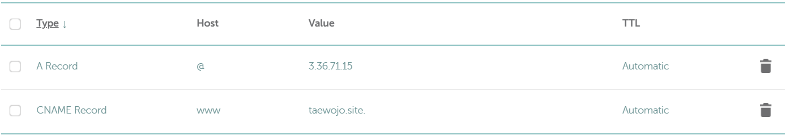

# DNS|SSL 인증서


## 선수 지식

- Docker Container와 AWS EC2를 활용한 웹 앱 배포
- Nginx를 통한 포트 포워딩


## 학습 목표

- DNS의 개념을 이해하고 DNS record를 설정하여 IP주소에 도메인을 연결할 수 있다.
- http와 https 프로토콜의 차이를 이해하고, SSL 인증서의 역할을 설명할 수 있다.
- certbot을 이용해 도메인에 SSL 인증서를 발급받을 수 있다.
- Nginx 설정파일을 수정하여 SSL 인증서를 적용할 수 있다.


## Warm-up

- 여러분은 개발한 앱을 Docker Image로 포장하고 배포한 후, AWS EC2에서 웹 서버를 실행할 수 있게 되었습니다.
- 저번 시간에 EC2 인스턴스의 IPv4주소를 통해 배포한 웹서버에 접속해봤는데요.
- IPv4 주소는 너무 못 생겼으니까, 우리가 아는 주소, `www.naver.com`같이 예쁜 이름표를 붙여 봅시다.
- 그리고 그 이름표에 인증서를 발급받아 보안적으로 뛰어난 https 주소로 접속할 수 있게 해주겠습니다.


## 이론

### DNS(Domain Name System)

#### DNS란?

- 사람이 보기 좋은 문자열 주소를 컴퓨터가 이해하는 IP 주소로 변환해주는 시스템


#### DNS record

- 도메인을 어디에 연결할지에 대한 설정 정보
- 여러 종류의 record가 있는데.. 자주 쓰는 두 개만 학습할 것
  - A
    - 도메인을 IP 주소로 연결하는 record
    - DNS의 핵심
  - CNAME
    - 도메인을 다른 도메인으로 연결하는 record
    - ex) `www.naver.com` -> `naver.com`


### SSL 인증서

#### HTTP | HTTPS

- http
  - 서버와 클라이언트가 통신할 때, 데이터를 원형으로 주고 받는 프로토콜
  - 중간에서 데이터를 탈취했을 때, 데이터가 평문으로 되어 있어 유출되기 쉬움
- https
  - session이 새로 생길 때마다 서버와 클라이언트가 난수를 교환
  - 그 난수를 기반으로 양측에 대칭 key(public key + private key)를 생성
  - random seed의 역할을 하는 key를 바탕으로 데이터를 암호화
  - key가 없으면 데이터를 복호화할 수 없음


#### SSL certificate

- 웹사이트의 신원을 증명하고, 데이터를 암호화해서 안전하게 전송하도록 해주는 디지털 증명서
- TLS라고도 부름
  - 원래 TLS가 맞는 표현이고 SSL은 비슷한 기능을 하는 옛날 기술인데..
  - 관례적으로 SSL을 더 많이 씀. 지금은 사실상 동의어로 봐도 됨

- 일반적으로 Nginx를 통해 관리됨
  - 인증 key 관리
  - http -> https 리디렉션


## 실습

### DNS 설정

- Namecheap에서 도메인 구매
  - 이번 회차에는 강사가 미리 구매해둔 도메인을 사용
  - DNS 최초 설정시 world wide web에 전파되는 시간이 최대 48시간까지 걸릴 수 있음
  - 보통은 수 분~ 수 시간 내에 됨
  
- DNS record 설정

  - @는 root 도메인을 의미함

  

- Django settings 수정
  
  - `ALLOWED_HOSTS`에 `'domain.com', 'www.domain.com'` 추가
  - 기존에 있던 IPv4 주소는 삭제해주는 것을 권장
  
- 도메인을 통한 서버 접속 확인

  - http로 접속


### SSL 인증서 발급 및 등록

- 보안 그룹에서 443 PORT 열기

  - 80은 지난 차시 실습으로 이미 열려 있음

- 호스트 엔진에 certbot 설치

  `apt install certbot python3-certbot-nginx`

- SSL 인증서 발급

  `certbot --nginx -d <domain.com> -d <www.domain.com> --redirect`

- Nginx 설정 파일 수정

  `nano /etc/nginx/sites-available/default`

  ```nginx
  # HTTP 요청 → HTTPS 리디렉션
  server {
      listen 80;
      server_name domain.com www.domain.com;
  
      return 301 https://$host$request_uri;
  }
  
  # HTTPS 요청 처리
  server {
      listen 443 ssl;
      server_name domain.com www.domain.com;
  
      # SSL 인증서 경로 (Certbot 발급 기준)
      ssl_certificate     /etc/letsencrypt/live/domain.com/fullchain.pem;
      ssl_certificate_key /etc/letsencrypt/live/domain.com/privkey.pem;
  
      # SSL 보안 설정 (권장)
      ssl_protocols TLSv1.2 TLSv1.3;
      ssl_ciphers HIGH:!aNULL:!MD5;
  
      location / {
          proxy_pass http://127.0.0.1:8000;  # uvicorn 내부 포트
          proxy_set_header Host $host;
          proxy_set_header X-Real-IP $remote_addr;
          proxy_set_header X-Forwarded-For $proxy_add_x_forwarded_for;
          proxy_set_header X-Forwarded-Proto $scheme;
      }
  }
  ```

- 문법 검사

  `nginx -t`

- nginx 재실행

  `systemctl restart nginx`

- 자동갱신 적용 여부 확인

  - 발급 시 기본값이 자동갱신 적용이긴 함. 잘 돼있는지 확인만 하는 것

    `certbot renew --dry-run`

- https 접속 확인

  - 외부 터미널에서 접속 확인할 것

    `curl -I https://domain.com`


## Wrap-up Quiz

- DNS record에는 어떤 것들이 있나요? 각각 어떤 설정을 해줘야 하는지 떠올려봅시다.
- http와 https 프로토콜의 차이는 무엇인가요?
- SSL인증서를 발급받고 설정을 끝마친 후에, http로 서버에 접속하면 요청이 어떻게 처리되나요?


## 강의 마무리

- 이제 하나의 완성된 웹 서비스를 배포하는 모든 과정이 완료되었습니다.
- 앞으로 배워나갈 내용들은 이 과정을 조금 더 세밀하게 하거나, 쉽게 하거나, 모니터링하거나 하며 살을 덧붙이는 과정이 될 것입니다.
- 서비스를 만들어 배포하는 과정과, 그렇게 만들어진 구조에서 사용자의 요청이 어떻게 흘러가는지를 반복해서 떠올려보시기 바랍니다.
- 다음 차시에는 이 모든 과정을 `commit-push` 한 번으로 자동화하는 CI-CD에 대해 배워보겠습니다.


## 수강생 피드백

- 수강생 1

  

- 수강생 2

  오늘 수업까지 들으면서 더이상 docker와 mobaXterm, ec2, 보안그룹 설정, 도메인이 어렵지는 않게 느껴졌습니다. 또 dns라는 개념은 알고 있었지만 CNAME이나 A record는 처음 들어봐서 새로운 개념도 학습할 수 있었습니다. 다만 명령어가 아직 완전히 익숙하진 않아서 각 단어가 무슨 의미인지 정리해놓는 것이 중요하다는 생각이 들었습니다.


## 소감

- 뒤에 CI-CD나 DB같은 차시가 좀 남긴 했지만.. 중요한 배포 사이클 하나는 또 끝났다. 뿌듯.
  - 1회차에 비하면 학습자들 배경지식이 좀 있는 상태긴 하지만.. 배포 관련해서는 배운 적이 없는 분들인데
  - 6시간 정도 수업해서 docker 이미지 만들고 aws 인스턴스 생성해서 배포하고 nginx 붙이고 도메인 붙이고 ssl 인증서 받고..
  - 웹앱 배포 전체 과정을 이해하고 스스로 코드 뒤져가면서 해볼 수 있는 수준까지 잘 도달하게 해드린 것 같다.
- 내 실력이 진짜 많이 늘었다.
  - 실습 준비하면서, 같은 환경에서 나 혼자 처음부터 끝까지 쓱 돌려보는데 10여 분만에 다 돼서 스스로도 좀 놀랐다.
  - 예전엔 자세히 들여다보지 않았던 코드나 설정파일들도 점점 더 많이 눈에 들어오고
  - 시스템에 대한 이해도가 많이 올라오면서 어지간한 상황에도 GPT에 의존하지 않고 디버깅을 할 수 있게 성장했다는게 느껴진다.
  - 앱별로 세부적인 문법 같은 건 당연히 못 외워서 GPT 갖다 쓰긴 하지만, 구조가 어떻게 돼있고 에러 로그 보면서 디버깅해가는 과정이 익숙해지니까 이제 에러를 봐도 무섭지 않고, 논리적으로 추론해나갈 수 있다.
  - 요즘은 멘토링 로그 안 쓰고 있긴 해도 꾸준히 디버깅 흐름 잡아드리고 있는데 특별히 막힌다, 답없다 싶은 케이스가 없다. 예전 같았으면 나도 해결 못 하고 몇 시간씩 머리 박고 있었을 문제들인데 지금은 다 길이 보이는게 신기하다.