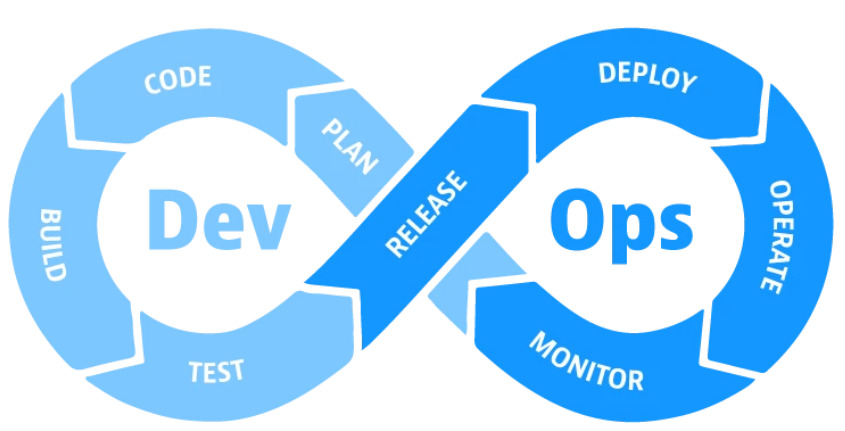
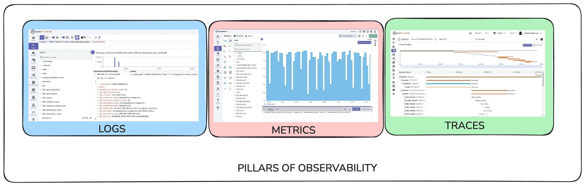

# Wrap-up 및 앞으로의 학습 방향 안내

## Warm-up

* 9차시에 걸친 긴 여정이 끝났습니다. 수고하셨습니다.

* 마지막 강의에서는 우리가 배운 것들을 전체적으로 돌아보고

* 여러분이 배운 개념들을 바탕으로 실제로 개발할 때 겪을 문제들과 그것을 해결해나갈 수 있는 방향성을 안내해드리며 강의를 마무리하겠습니다.

  

## 전 과정 Wrap-up : DevOps

*   약 열 시간에 거쳐 로컬 개발 환경 구축부터 멀티 클라우드 배포, 도메인 연결, CI/CD 자동화까지의 여정을 모두 경험해보셨습니다.
*   각 기술(venv, Docker, AWS, Nginx, CI/CD 등)이 전체 그림에서 어떤 역할을 하는지 연결해봅시다.

- 우리가 사용한 도구들은 언제든지 다른 서비스로 대체될 수 있습니다.
- 도구의 사용법은 바로 기억하지 못해도 되지만, 이 그림을 통해 DevOps의 과정이 실제로 어떻게 구현되는지를 설명할 수는 있어야 합니다.

## 그림의 마지막 조각 : Observability

### 소개

*   위 그림에서 `Monitoring`은 여러분이 아직 설명하기 어려운 영역으로 남아 있을 것 같습니다.
*   요즘은 `Monitoring`보다 조금 더 확장된 개념으로서 `Observability`라는 표현을 쓰곤 하는데요.
*   DevOps에서도 하나의 큰 축을 담당하지만 강의에서는 제외되었습니다.
    *   실 서비스 운영 전 단계에서는 크게 필요하지 않고
    *   DevOps 엔지니어가 아니라면 직접 구현해야 하는 경우는 매우 드물기 때문입니다.
*   그래도 뭐 하는 건진 알아야 하니까 간단하게 개념만 짚고 갑시다.

### Observability란?

*   인프라의 상태 뿐만 아니라 시스템 전체의 내부 동작과 사용자 경험을 이해하는 패러다임이자 방법론
    *   이미 알려진 패턴 외에 앞으로 나타날 수 있는 문제까지 사전적으로 대응

    *   서버의 상태가 아니라 **사용자 요청 단위**를 중심으로 하여 성공 / 실패를 구분

- Observability 모델이 활용하는 세 가지 데이터
  - Logs : 특정 시점에 발생한 이벤트 단위 기록. 에러 메시지 등
  - Metrics : 시간 단위 수치 데이터. CPU 사용률, 메모리 사용량, 요청 횟수 등
  - Traces : 분산 시스템 환경에서 단일 요청이 여러 서비스를 거쳐가는 흐름을 나타내는 데이터 구조

## 개념에서 실전으로 : 현명하게 개발하기

### 개요

- 여러분이 처음 개발을 공부하기 시작했을 때는 `.py` 파일 
- 여러 개의 앱이 하나의 시스템을 이루는 복합적인 환경에서의 개발 상황을 
- AI를 활용하든 말든, 개발을 해나가면서 권장되는 원칙들이 있는데, AI를 열심히 쓰다보면 더 지키기가 어렵습니다.

### AI와 함께하는 개발

*   

### AI와 함께하는 디버깅

- 디버깅을 AI와 함께 한다고 해서, 오류 메시지를 마주했을 때 냅다 GPT에게 달려가는 것은 지양되어야 합니다.

## 4. 강의를 마치며

*   기술의 사용법을 아는 것을 넘어, '왜' 사용하는지 이해하는 개발자
*   문제 해결 과정 자체를 즐기고, 동료와 함께 성장하는 개발자
*   앞으로의 학습 방향 및 격려 메시지
