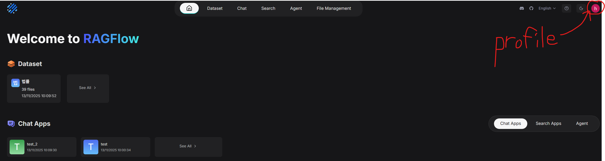
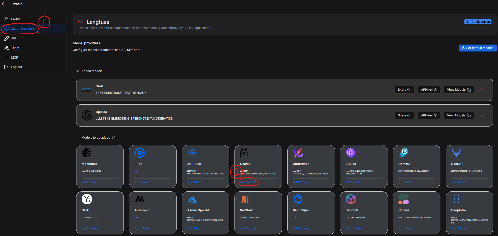
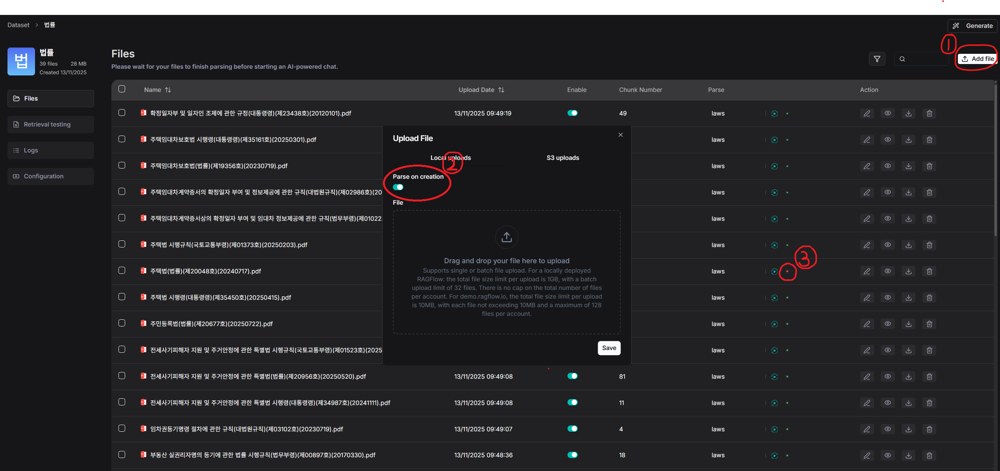
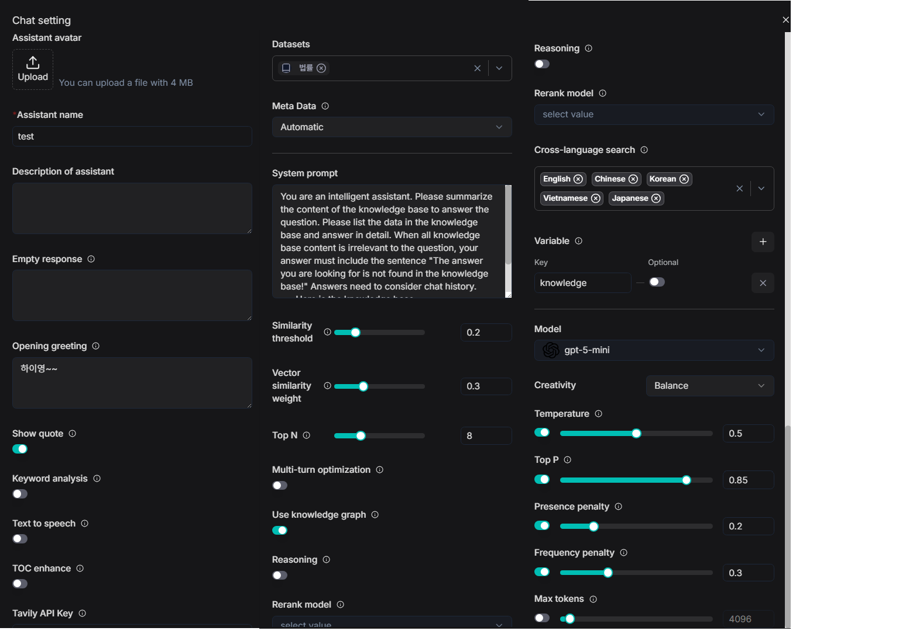

# RAGFlow 사용 가이드

## RAGFlow란?

**문서 업로드·전처리 자동화 플랫폼** — PDF/문서 업로드하면 자동으로 텍스트 추출·분할·임베딩까지 처리

**RAG 파이프라인 자동 생성 서비스** — 벡터DB, LLM, 검색 설정을 UI로 쉽게 구성해 에이전트/챗봇 생성

**워크플로우 & API 제공** — 만든 RAG 에이전트를 그대로 API/웹으로 배포하고 다른 시스템과 연동 가능

##### -> RAG 에이전트를 쉽게 만들고 export할 수 있는 서비스!!

## 사용법

### 모델 설정

- profile 클릭 -> 왼쪽 탭에서 Model providers 선택

- 사용할 모델 `Add Model` -> 각 서비스에서 발급받은 API Key 입력

### Dataset

- 주제나 용도에 따라 데이터를 분류하고 여러 개의 dataset을 만들 수 있음
- Add file 클릭
- parse on creation 체크
  - 데이터 저장 시 OCR, 토크나이징, 임베딩까지 한 번에 수행
  - 오류가 잦으니 확인하고 재실행해줘야 함. 아래 그림의 `3` 참고

### Chat

- Dataset에서 만든 RAG 데이터를 참조하는 LLM을 생성하는 기능

#### 기능 목록

##### 우리가 사용할 가능성이 높은 것, 무슨 기능인지 한 눈에 파악하기 어려운 것 중심으로 간단하게 설명

- Empty response

  - dataset으로 만든 knowledge base 검색 결과 사용자 요청에 응답할만한 정보가 없을 때 출력할 답변
  - 비워 두면 LLM이 알아서 답변함

- Show quote

  - 응답할 때 인용한 텍스트 그대로를 그대로 출력할지 여부

- Keyword analysis

  - LLM이 사용자의 질문에서 핵심 키워드를 뽑아내고 불필요한 정보들은 제거하여 정제한 후 처리
  - 전체 latency는 약간 늘어남
  - 주절주절 질문 길어지는 경우가 많을 거라 웬만하면 켜주는게 좋을 듯

- TOC enhance

  - 문서의 목차를 추출하고 목차에도 별도의 가중치를 줘서 retrieval을 수행하는 방식
  - 법률 쪽은 특히 목차가 잘 돼있어서 켜주면 검색 성능이 많이 좋아진다고 함

- Tavily API Key

  - 웹 검색 API 연동
  - 법률이나 판례 같은, 높은 신뢰도가 요구되는 정보들은 실시간 웹 검색을 통해 확보할 건 아니니까 일단 비활성화
  - 다른 기능에서 웹 검색이 필요하면 그 기능용 chat을 별도로 생성해서 쓰면 될 듯

- Datasets

  - 참조할 dataset 선택. 여러 개 선택 가능

- Meta Data

  - 각 문서에 대한 metadata를 retrieval에 활용할지 여부
  - 우리 dataset은 대체로 metadata가 많고 잘 구조화돼있어서 사용하면 좋음
  - `automatic` 설정이 무난함

- System prompt

  - default로 knowldege base 참조해서 대답하도록 프롬프트가 작성돼있긴 한데, 좀 튜닝할 필요가 있음
    - 그냥 뒀더니 응답에 knowledge base같은 단어를 그대로 사용함
    - 출력형식, 분량, 답변 요약 제공 등 추가 요망

- Similarity threshold

  - 문서 chunk 중 사용자 질문과의 유사도가 threshold 미만인 chunk는 검색 대상에서 제외함
  - 높일수록 헛소리할 가능성은 줄어들겠지만 관련성이 있는 chunk도 제외할 가능성이 생김
  - GPT가 제시한 기준값은 0.15~0.25

- Vector similarity weight

  - 벡터유사도 검색(의미 기반 검색)의 비율
  - 높일수록 단어가 좀 달라져도 의미가 얼추 비슷한 내용들을 잘 찾음
  - 우리는 법률 데이터를 다루니까, 정밀하고 정확한 단어 선택이 중요하므로 수치를 좀 낮추는게 좋음
    - GPT가 제시한 기준값은 0.2~0.4

- Top N

  - 최종적으로 LLM에 전달할 chunk의 수
  - 높이면 더 다양한 정보가 포함되는 대신 답변이 장황해질 수 있음

- Multi-turn optimization

  - 멀티턴 대화, 맥락 유지 여부
  - 우리 서비스에서는 무조건 on

- Use knowledge graph

  - dataset 파싱할 때 entity를 추출하고 그걸 기반으로 RAG data를 그래프 형태로 구성
  - 다단계 탐색을 통해 개념적으로 연결된 문서들을 찾아내는 방식
  - latency를 크게 늘리는 단점이 있으나, 우리 서비스에서는 꼭 필요할 듯

- Reasoning

  - RAG 파이프라인의 추론 워크플로우 활성화
  - step-by-step 추론을 좀 더 잘 하게 해줌

- Rerank model

  - 별도의 모델을 통해 청크 검색 결과를 재정렬하는 과정 추가
  - 모델도 따로 연결해야 하고 latency, 비용도 늘어남
  - GPT는 on을 추천하긴 했는데 검토해봐야 할 듯

- Cross language search

  - 사용자 질문과 dataset에서 사용하는 언어가 다른 경우에도 비슷한 벡터를 잘 검색함
  - 법률 쪽은 100% 한국어니까 off해도 될 듯
  - 가이드라인이나 기타 크롤링해온 자료를 사용하게 되면 영어 정도는 켜도 되고..

- Variable

  - system prompt에 넣을 수 있는 변수 설정
  - knowledge는 기본값으로 들어가 있음
  - `optional` 체크 해제된 상태에서 system prompt에 해당 변수가 사용되지 않으면 오류 발생

- Model

  - 모델 선택
  - 모델 add하고 API key 등록해놓은 것만 사용 가능

- Creativity

  - temperature, top_p 등 응답 창의성 관련 파라미터 설정
  - 기본값 몇 종류로 제공하고, 커스터마이징 가능
  - gpt-5 등 일부 모델에서 없는 파라미터는 체크 해제해줘야 오류 안 남

  

### Search

- dataset 기반으로 retrieval만 해주는 기능
- 우리는 안 쓸 듯

### Agent

- multi-agent 그래프 설계하는 기능
- 외부 앱에서 만든 agent도 import할 수 있음

### File Management

- Datasets에 업로드된 원본 파일을 관리하는 기능
