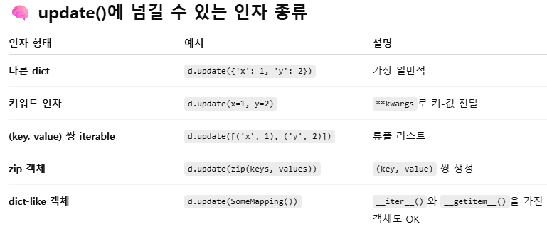

# Non-sequence datatype

## Dict

- `dict.get(key)`과 `dict[key]`의 차이
  - `get`은 해당 키를 못 찾아도 None 또는 설정한 기본값을 반환함
  - dict[key]는 키를 찾지 못하면 오류 발생
  - 알고리즘 풀 때는 get을 쓰는 경우가 많아짐

- `dict.keys()`

  - `dict_keys(['name', 'age'])`
  - 실시간으로 원본과 동기화되는 확인 창(view object)

  - iterable
  - 인덱싱 불가하지만 list()로 변환 가능

  - `dict.values()`도 같음

  - `dict.items()`도 거의 같은데, 얘는 내부 요소가 tuple

- `dict.setdefault(key[,default])`

  - 키가 있으면 키와 연결된 값을 반환(= get)
  - 키가 없으면 default와 연결한 키를 딕셔너리에 추가하고 default를 반환
  - 분기처리해서 key를 생성하는 과정을 축약할 수 있음

  - default 인자의 default는 None

- `dict.update([other])`

  - other가 제공하는 key/value 쌍으로 딕셔너리를 갱신

  - 기존 key는 덮어씀

  - other에 들어갈 수 있는 자료형은 다양함. key-value 쌍을 나타내는 형태는 거의 가능

    

## Set

- set의 요소는 hashable해야 함
  - hashable하면 대~부분 immutable하긴 한데, 아닌 경우도 있긴 함
- `set.add(x)`
  - set에 x 요소 추가
  - 이미 x가 있다면 변화 없음

- `set.update(iterable)`
  - set에 iterable의 모든 요소를 추가
  - scalar는 못 넣음(add로 넣어야 함)

- `set.remove(x)`
  - set에서 x 요소 삭제
  - x가 없으면 keyError 발생

- `set.discard(x)`
  - set에서 x 요소 삭제
  - x가 없으면 아무 것도 안 함(에러, 출력, 반환 다 없음)

- `set.pop()`
  - 세트에서 임의의 요소를 제거하고 반환
    - 임의가 진짜 random은 아님

- 기타 집합용 메서드
  - difference, intersection, issubset, issuperset, isupperset, union
  - 연산자 사용해도 동일하게 작동