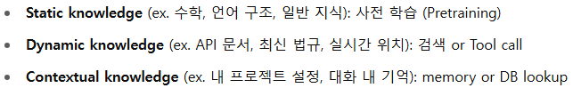

# Copilot - agent

https://www.notion.so/SSAFY-bc6a721139f14e0c8de66459a7fd7ddc?p=2347a051cee680ea8c12e5a8b0a611e7&pm=s

- AI 코딩 파트너인 코파일럿의 agent 기능
- 멀티턴 대화를 통해 프로젝트 전체 흐름을 파악하고 여러 파일을 동시에 수정하여 전체 기능을 자동 구현
- VS-Code의 extension을 활용해 바이브코딩 체험했음

- 완성된 코드는 동일 디렉토리 내에 첨부

## 질문/답변

- **1-1. 개발 도와주는 AI tool들 쓰면서 공통적으로 느끼는게, 모델에 학습된 것 말고 공식 API 문서 검색해서 그 문서 기반으로 코드 작성하도록 하면 훨씬 오류가 줄어들 것 같은데 그건 내부적으로 연산이 너무 많이 필요해서 잘 도입을 안 하는 건가?**

  - 물론 그렇지. 실시간 검색+RAG방식을 넣는게 충분히 유효한 전략이고 이미 cursor처럼 요즘 뜨는 tool들은 비슷한 방식을 적용했거나 시도하고 있음. MCP도 같은 흐름 속에 있고. 다만 내부 프로세스가 복잡해질수록 속도 저하, 비용 증가, UX 통제 난이도 상승 등의 문제도 함께 발생하기 때문에 trade-off도 고려해야 함.

- **1-2. 그럼 애초에 LLM 아키텍쳐를 설계할 때부터 실시간성이 강한 정보들은 가중치를 낮게 설정하고 실제로 모델을 사용할 때는 웹 검색이나 RAG같은 방식을 활용하는게 훨씬 더 효율적인 방법 아닌가?**

  - 맞음. 아래 이미지처럼 구분해서 학습하는 방법이 있음. 그렇게 될수록 LLM은 중앙에서 어떤 도구를 선택할지를 결정하는 역할만 하고, 실제 작업은 그 목적에 맞는 API를 호출해서 하는 방식이 되는 것.

  

- **1-3. 그게 transformer 이후의 패러다임이 되나? 일단 지금은 transformer 기반 모델 아키텍쳐에 저런 아이디어들을 집어넣기만 하고 있는 거지?**

  - 이런 방식에 맞는 새로운 아키텍쳐를 만드려는 노력도 이어지고 있긴 한데.. 무조건 그게 post transformer가 될거라고 확신하긴 어렵고 그냥 다양한 시도가 병행되고 있는 거지 일단은.

## 

## 소감

- 조금 복잡해지거나 코드가 쌓일수록 오류가 증가하긴 하는데, 이미 더 좋은 툴들도 나오고 있고, 모델이 개선되면 결국 해결될 문제로 보임
- 반면 자기도 모르게 직접 api_key를 입력하게 되는 등 비전문가가 쓰기에는 보안상 취약점이 크게 두드러질 것 같음. 이쪽은 개선하는데 조금은 더 많은 시간이 필요하지 않을까..
- 물론 지금도 프롬프팅에 따라 충분히 가능하긴 하겠지만, 내가 시키는 것만 하는게 아니라 자기가 먼저 개선사항을 제안하는 협업자로서의 역할을 좀 더 해주면 좋을 듯. 아마 그렇게 될 거고.
- 내가 잘 알지도 못하는 웹개발용 언어들로 시간 쏟아가며 만든 UI보다 더 괜찮게 만드는 데에 그리 오랜 시간이 걸릴 것 같지는 않다.. 나는 어떤 개발자가 되어야 할까 고민하게 된다.